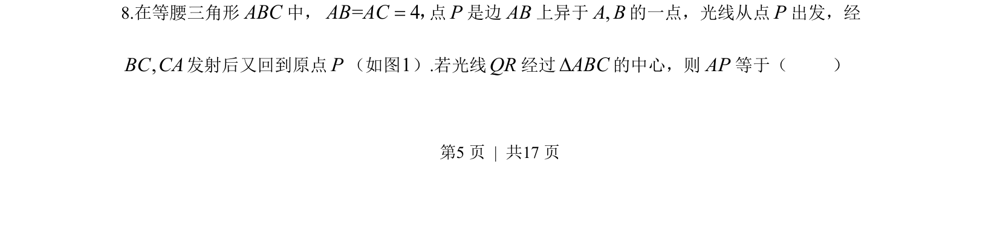
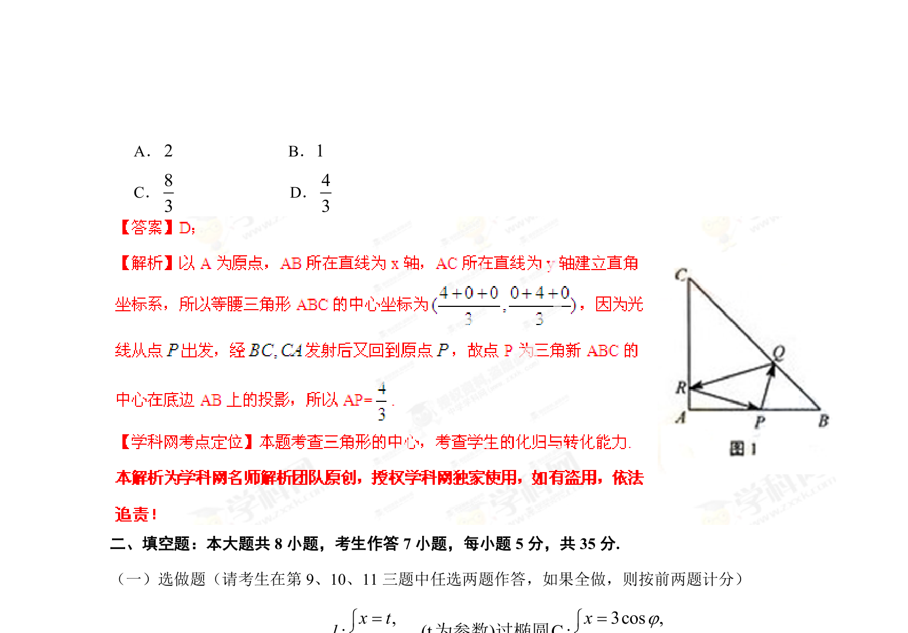

## 题面

## 摘要

等腰三角形中光线反射问题，利用对称性将折线转化为直线，结合重心性质求线段长度。

## 关联考点

- [[对称变换]]
- [[重心坐标]]
- [[1033-相似三角形|相似三角形]]
- [[671-几何计算|几何计算]]

## 答案与解析

> 📄 原 PDF 第 5 页：`素材/真题/湖南/2008-2024·（湖南）数学高考真题/2013年高考数学试卷（理）（湖南）（解析卷）.pdf`
