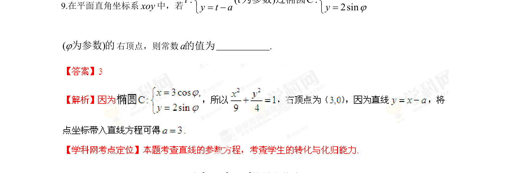

## 题面

## 摘要

题目给出参数方程和椭圆方程，通过参数方程过椭圆右顶点求参数a，并求相关最值。

## 关联考点

- [[061-方程|参数方程]]
- [[388-椭圆几何性质|椭圆性质]]
- [[286-函数的最值|最值]]

## 答案与解析

> 📄 原 PDF 第 6 页：`素材/真题/湖南/2008-2024·（湖南）数学高考真题/2013年高考数学试卷（理）（湖南）（解析卷）.pdf`
