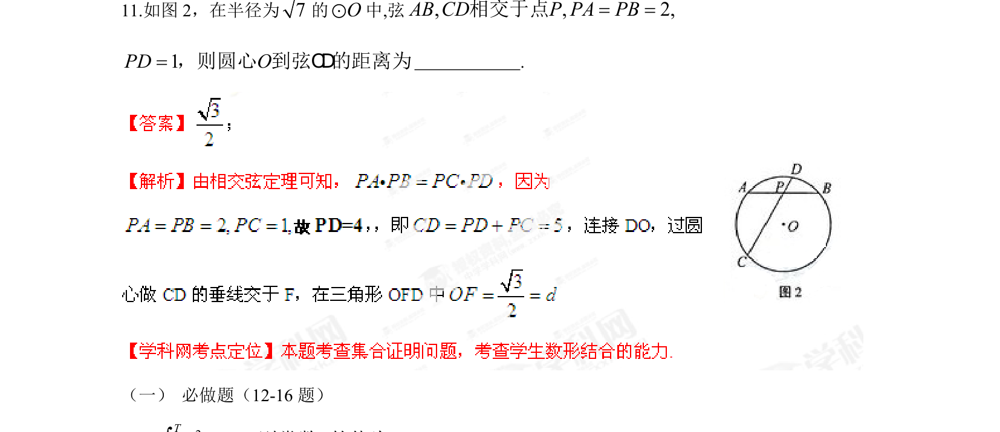

## 题面

## 摘要

如图，圆中弦AB、CD相交于点P，已知半径及部分线段长度，求圆心到弦CD的距离。

## 关联考点

- [[220-圆-定义|圆]]
- [[1416-相交弦定理|相交弦定理]]
- [[980-点到直线的距离|点到直线的距离]]

## 答案与解析

> 📄 原 PDF 第 7 页：`素材/真题/湖南/2008-2024·（湖南）数学高考真题/2013年高考数学试卷（理）（湖南）（解析卷）.pdf`
