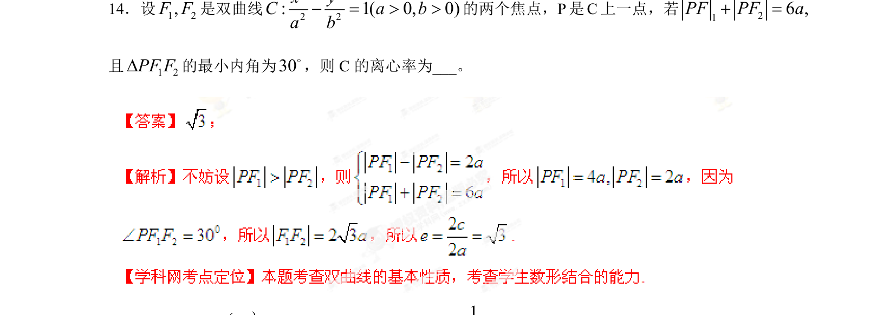

## 题面

## 摘要

双曲线定义与几何性质，结合焦点三角形和余弦定理求离心率

## 关联考点

- [[730-双曲线的定义|双曲线的定义]]
- [[1274-双曲线的几何性质|双曲线的几何性质]]
- [[126-定理|余弦定理]]
- [[391-椭圆离心率|离心率]]

## 答案与解析

> 📄 原 PDF 第 8 页：`素材/真题/湖南/2008-2024·（湖南）数学高考真题/2013年高考数学试卷（理）（湖南）（解析卷）.pdf`
