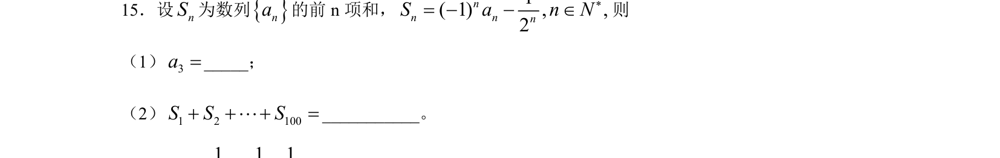
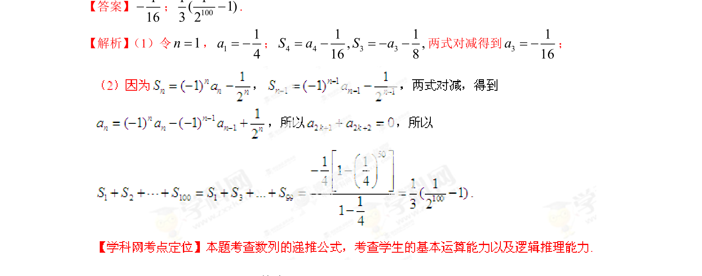

## 题面

## 摘要

本题通过函数与三角形边长条件，考查函数零点取值集合及存在性命题判断。

## 关联考点

- [[288-函数零点|函数的零点]]
- [[三角形的边长条件]]
- [[化归与转化思想]]
- [[存在性命题]]

## 答案与解析

> 📄 原 PDF 第 8 页：`素材/真题/湖南/2008-2024·（湖南）数学高考真题/2013年高考数学试卷（理）（湖南）（解析卷）.pdf`
