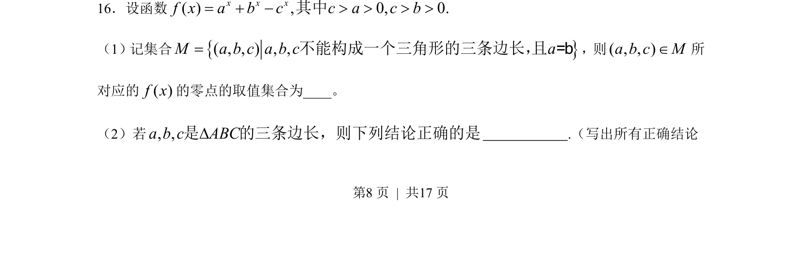
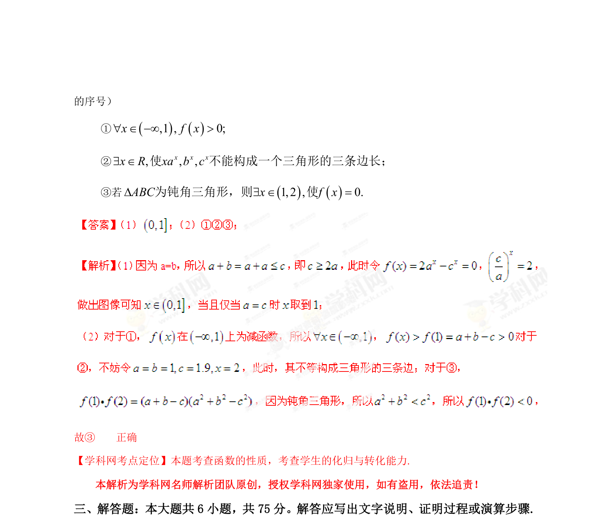

## 题面

## 摘要

考查分段函数零点的求解条件，结合三角形边长构成与集合知识进行参数分析。

## 关联考点

- [[290-分段函数|分段函数]]
- [[288-函数零点|函数的零点]]
- [[三角形边长关系]]
- [[042-集合|集合]]

## 答案与解析

> 📄 原 PDF 第 8 页：`素材/真题/湖南/2008-2024·（湖南）数学高考真题/2013年高考数学试卷（理）（湖南）（解析卷）.pdf`
