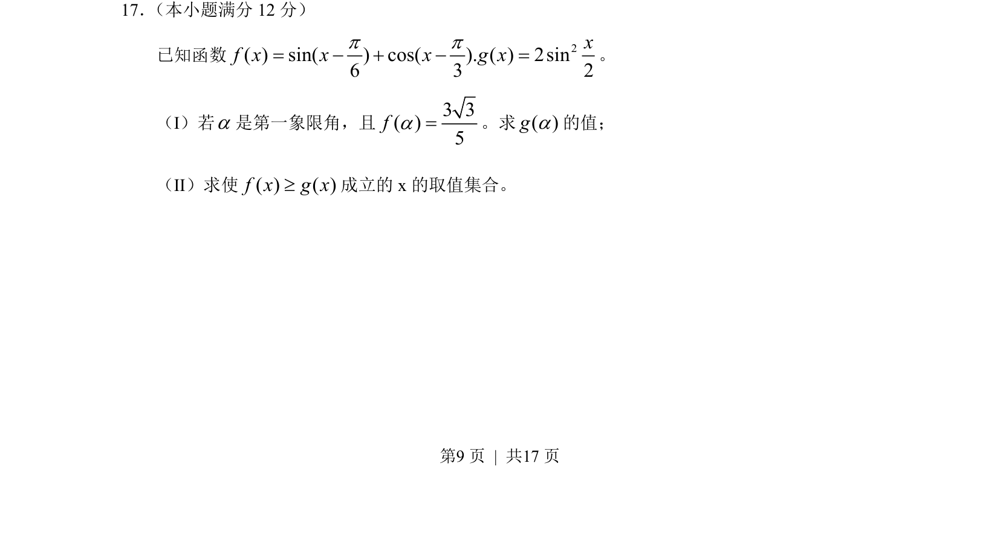
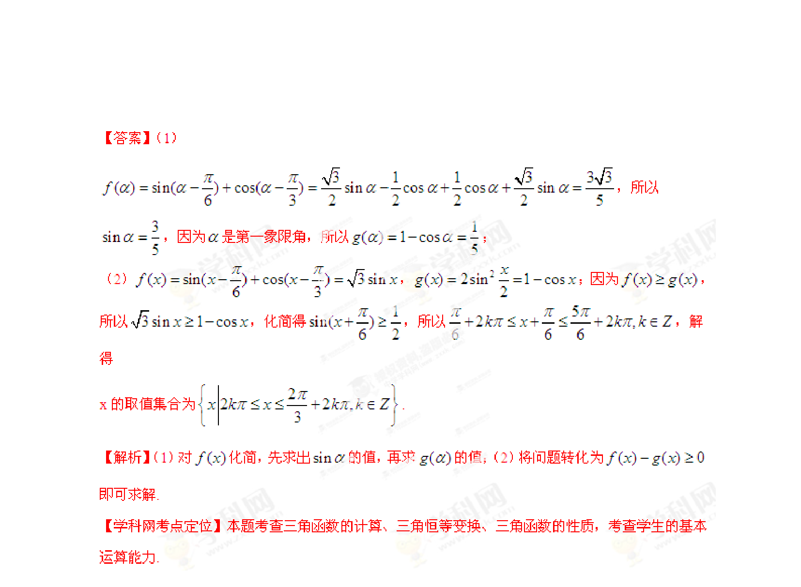

## 题面

## 摘要

已知函数涉及三角恒等变换求值及解三角不等式，考查同角关系和二倍角公式应用。

## 关联考点

- [[272-三角恒等变换|三角恒等变换]]
- [[610-三角函数求值|三角函数求值]]
- [[1418-解三角不等式|解三角不等式]]
- [[741-同角三角函数基本关系|同角三角函数基本关系]]

## 答案与解析

> 📄 原 PDF 第 9 页：`素材/真题/湖南/2008-2024·（湖南）数学高考真题/2013年高考数学试卷（理）（湖南）（解析卷）.pdf`
