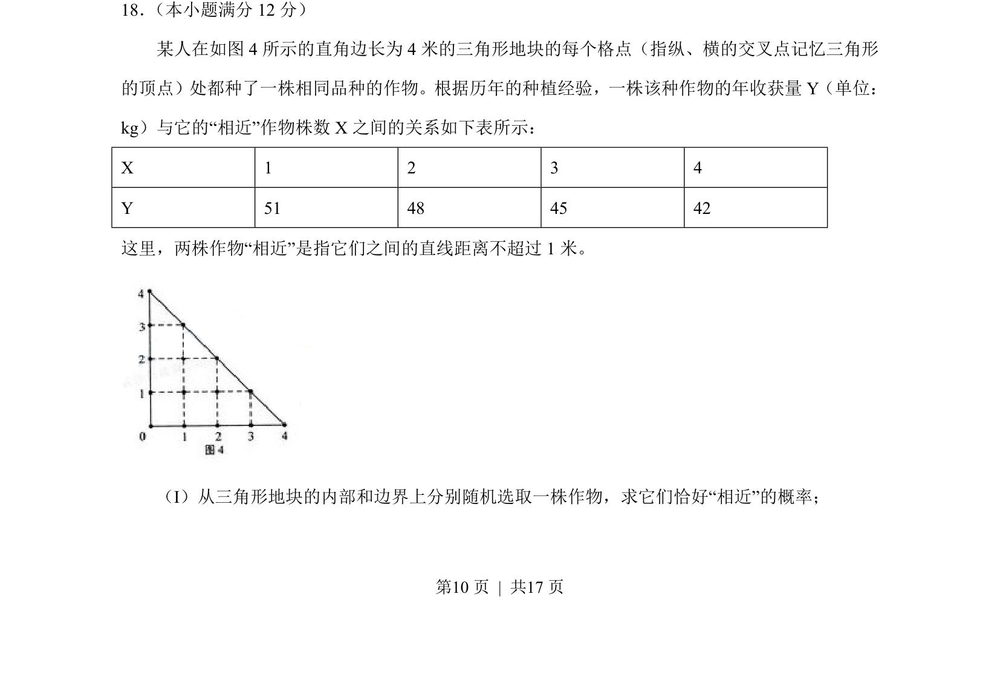
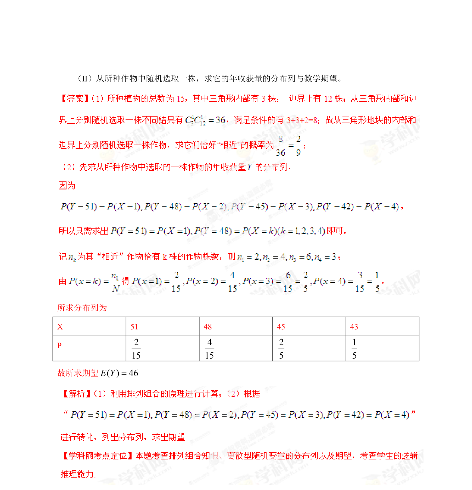

## 题面

## 摘要

计算三角形地块内格点作物间“相近”关系与随机选取概率

## 关联考点

- [[320-古典概型|古典概型]]
- [[1090-组合计数|组合计数]]
- [[667-几何概型|几何概型]]
- [[948-概率计算|概率计算]]

## 答案与解析

> 📄 原 PDF 第 10 页：`素材/真题/湖南/2008-2024·（湖南）数学高考真题/2013年高考数学试卷（理）（湖南）（解析卷）.pdf`
