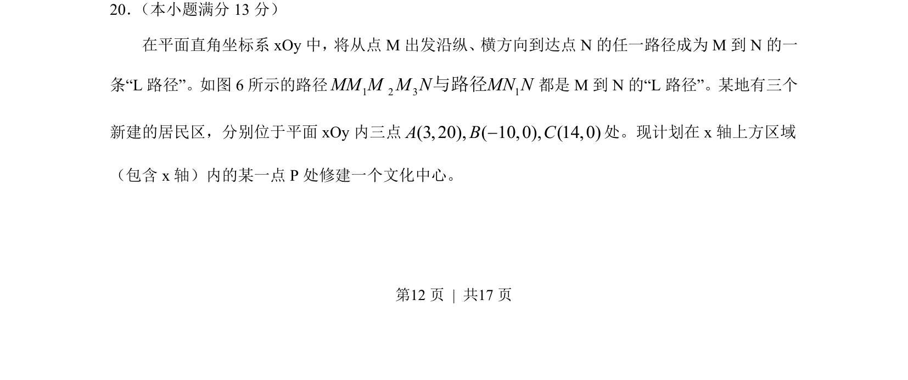
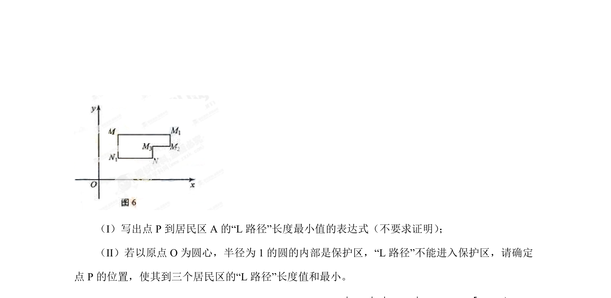
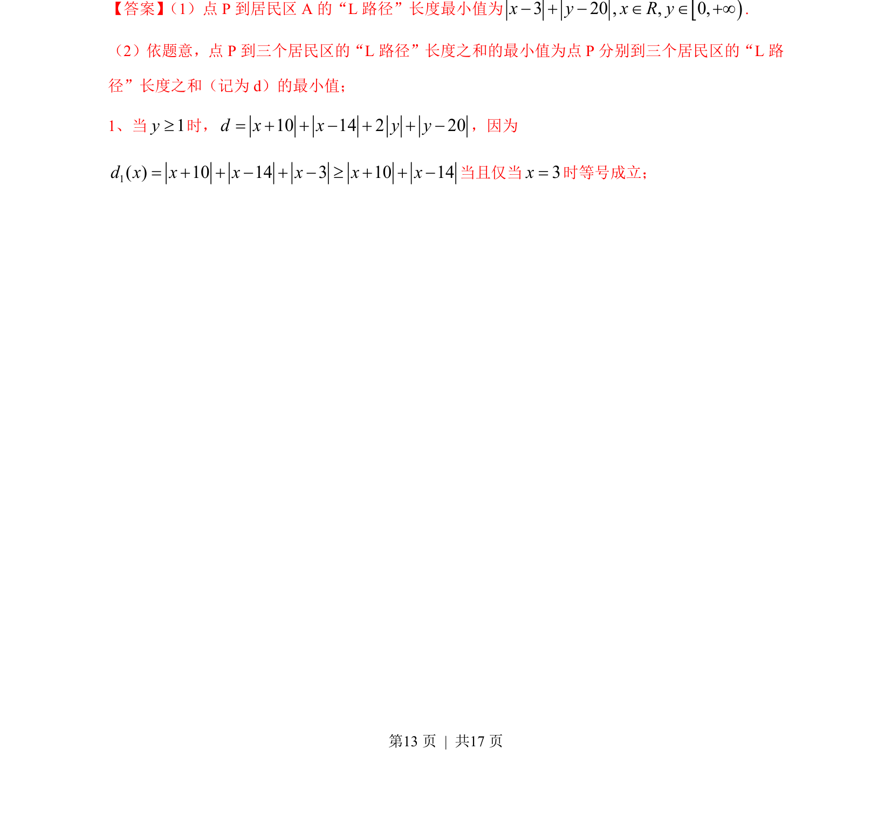
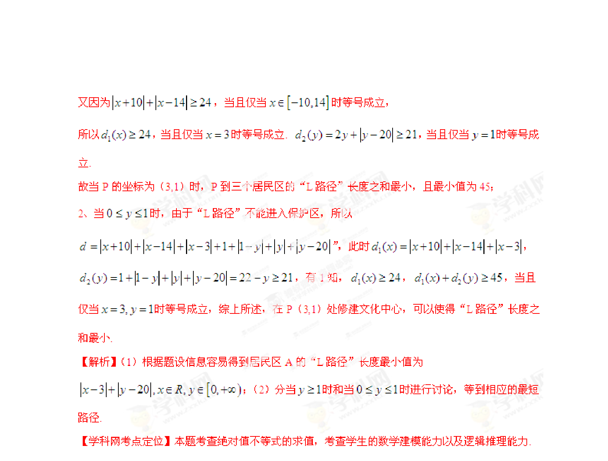

## 题面

## 摘要

在平面直角坐标系中，根据“L 路径”定义，求一点使得到三个定点的路径和最小。

## 关联考点

- [[132-平面直角坐标系|平面直角坐标系]]
- [[距离和最小值]]
- [[路径问题]]

## 答案与解析

> 📄 原 PDF 第 12 页：`素材/真题/湖南/2008-2024·（湖南）数学高考真题/2013年高考数学试卷（理）（湖南）（解析卷）.pdf`
