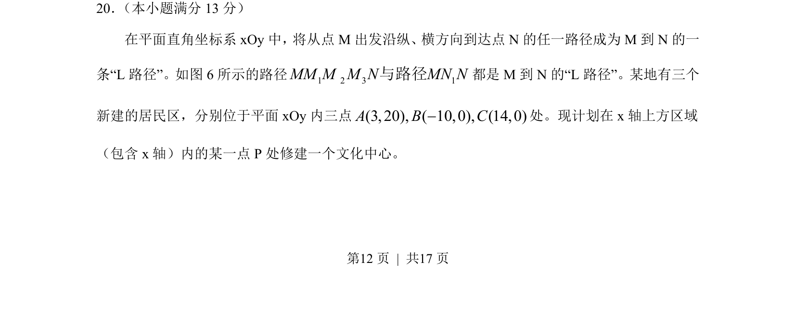
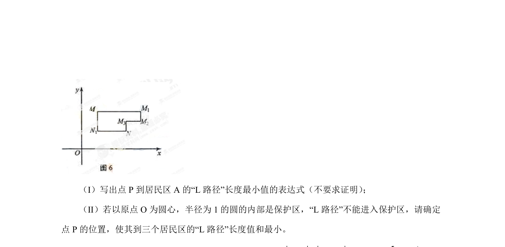
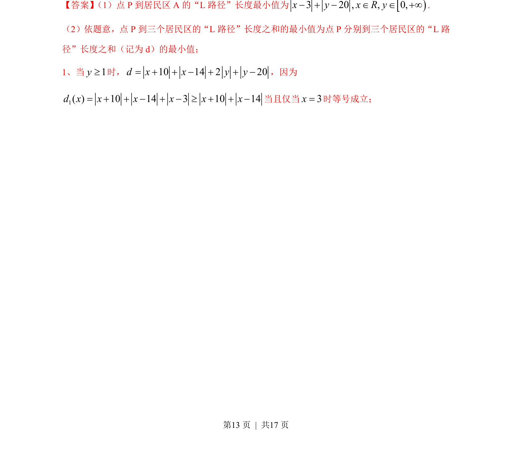
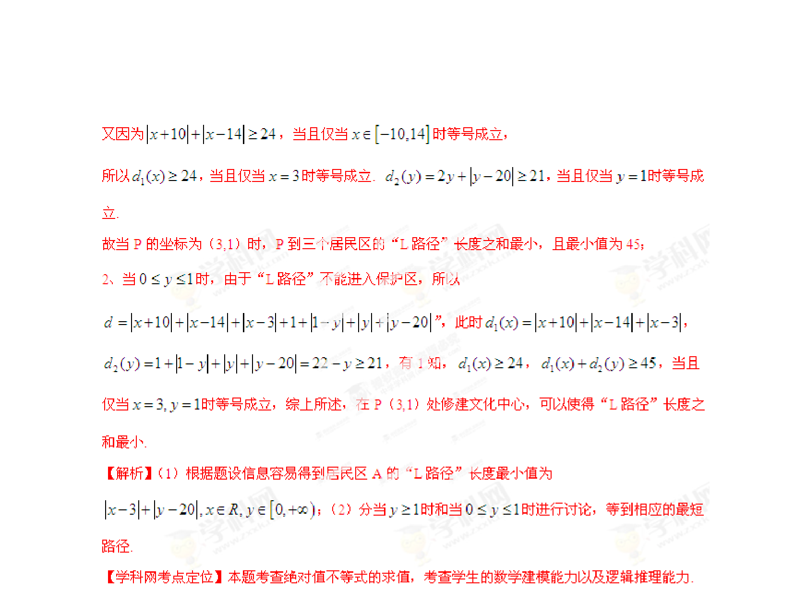

## 题面

## 摘要

在平面直角坐标系中，根据“L 路径”定义，求一点使得到三个定点的路径和最小。

## 关联考点

- [[132-平面直角坐标系|平面直角坐标系]]
- [[距离和最小值]]
- [[路径问题]]

## 答案与解析

> 📄 原 PDF 第 12 页：`素材/真题/湖南/2008-2024·（湖南）数学高考真题/2013年高考数学试卷（理）（湖南）（解析卷）.pdf`

<!-- 题干文本-start -->
## 题干文本
20． （本小题满分13分）
在平面直角坐标系xOy中，将从点M出发沿纵、横方向到达点N的任一路径成为M到N的一
条“L路径”。如图6所示的路径 1 2 3 1MM M M N MN N与路径都是M到N的“L路径”。某地有三个
新建的居民区，分别位于平面xOy内三点(3, 20), ( 10,0), (14,0)A B C-处。现计划在x轴上方区域
（包含x轴）内的某一点P处修建一个文化中心。
<!-- 题干文本-end -->

<!-- 解析文本-start -->
## 解析文本

<!-- 解析文本-end -->
