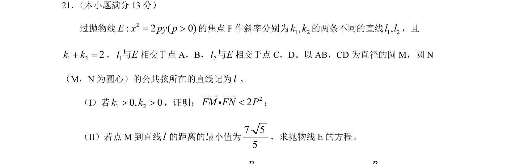
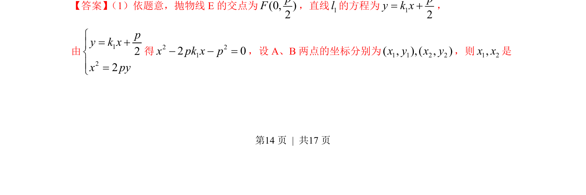
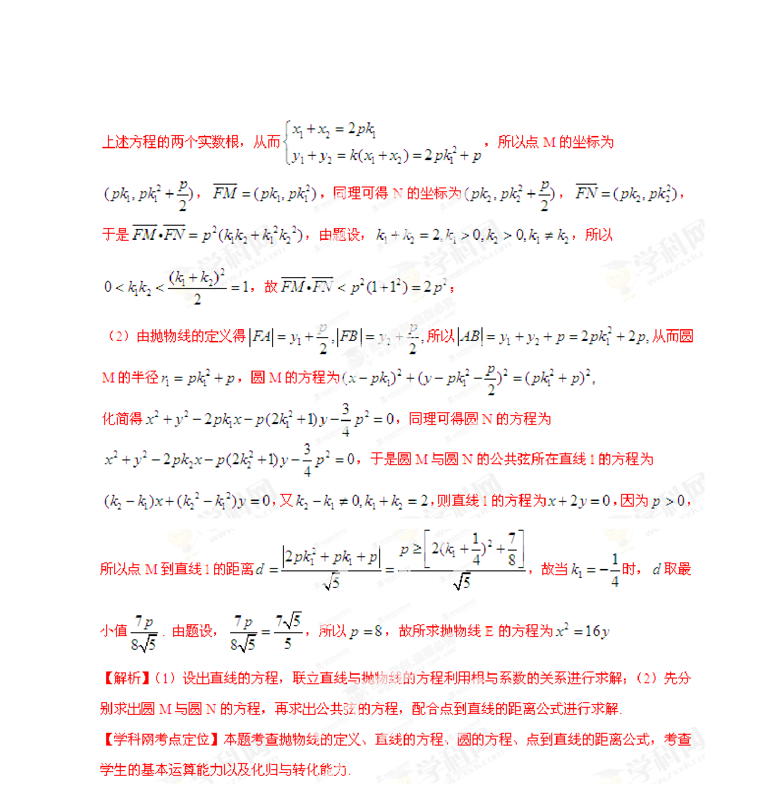

## 题面

## 摘要

抛物线与直线相交，结合圆、公共弦、向量数量积与最值求方程的综合题

## 关联考点

- [[1166-抛物线标准方程|抛物线标准方程]]
- [[1005-直线与圆锥曲线位置关系|直线与圆锥曲线位置关系]]
- [[234-韦达定理-初中|韦达定理]]
- [[圆方程]]
- [[751-向量数量积|向量数量积]]
- [[点到直线距离最值]]

## 答案与解析

> 📄 原 PDF 第 14 页：`素材/真题/湖南/2008-2024·（湖南）数学高考真题/2013年高考数学试卷（理）（湖南）（解析卷）.pdf`
