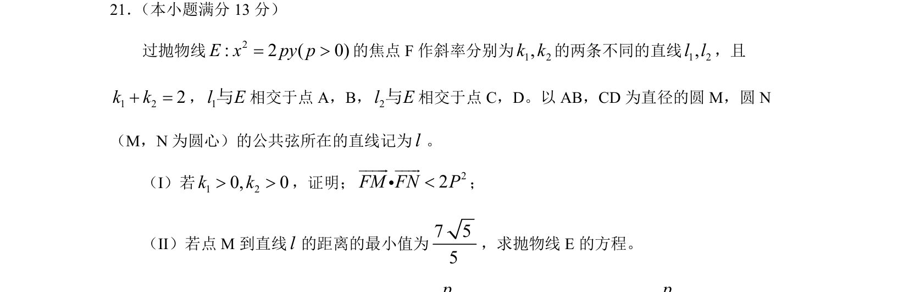
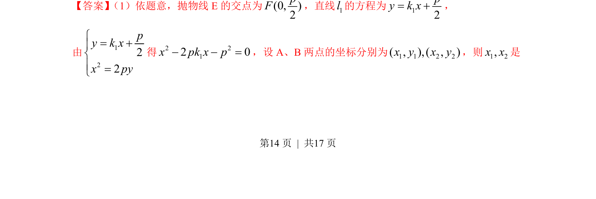
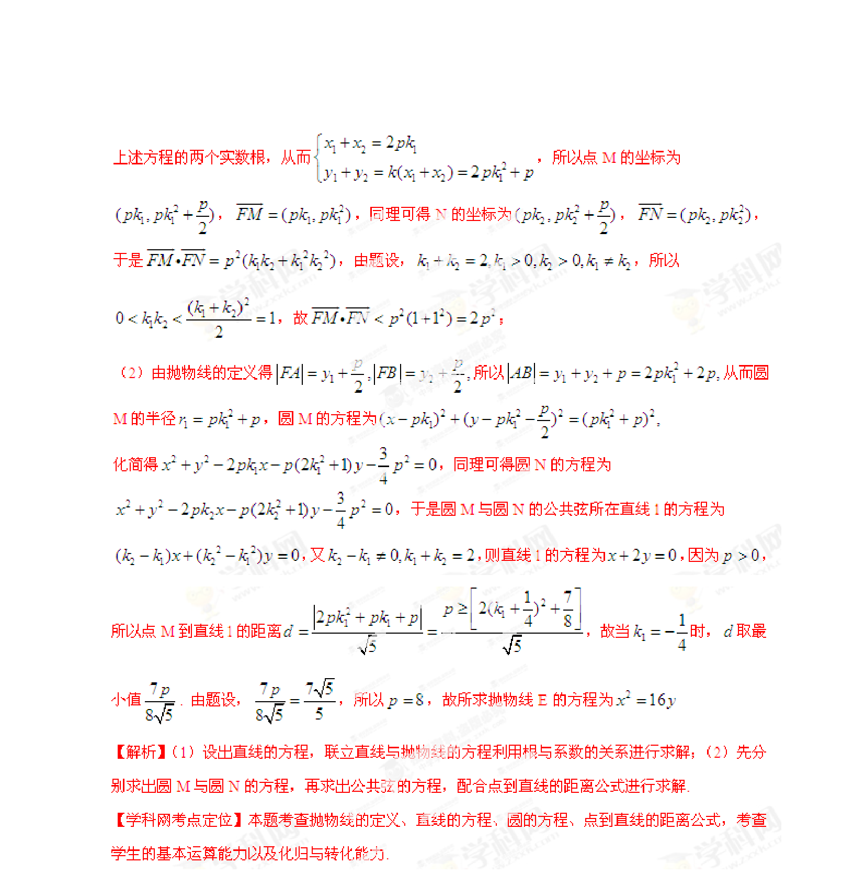

## 题面

## 摘要

抛物线与直线相交，结合圆、公共弦、向量数量积与最值求方程的综合题

## 关联考点

- [[1166-抛物线标准方程|抛物线标准方程]]
- [[1006-直线与圆锥曲线的位置关系|直线与圆锥曲线位置关系]]
- [[234-韦达定理-初中|韦达定理]]
- [[782-圆的方程|圆方程]]
- [[328-向量的数量积|向量数量积]]
- [[点到直线距离最值]]

## 答案与解析

> 📄 原 PDF 第 14 页：`素材/真题/湖南/2008-2024·（湖南）数学高考真题/2013年高考数学试卷（理）（湖南）（解析卷）.pdf`

<!-- 题干文本-start -->
## 题干文本
21． （本小题满分13分）
过抛物线2: 2 ( 0)E x py p= >的焦点F作斜率分别为1 2,k k的两条不同的直线1 2,l l，且
1 22k k+ =，1l E与相交于点A，B，2l E与相交于点C，D。以AB，CD为直径的圆M，圆N
（M，N为圆心）的公共弦所在的直线记为l。
（I）若1 20, 0k k> >，证明； 22FM FN P<uuuu r uuu rg；
（II）若点M到直线l的距离的最小值为7 55
，求抛物线E的方程。
<!-- 题干文本-end -->

<!-- 解析文本-start -->
## 解析文本
【答案】 （1）依题意，抛物线E的交点为(0, )2pF，直线1l的方程为12py k x= +，
由 1222py k xx pyì= +ïíï=î
得2 212 0x pk x p- - =，设A、B两点的坐标分别为1 1 2 2( , ),( , )x y x y，则1 2,x x是
<!-- 解析文本-end -->
