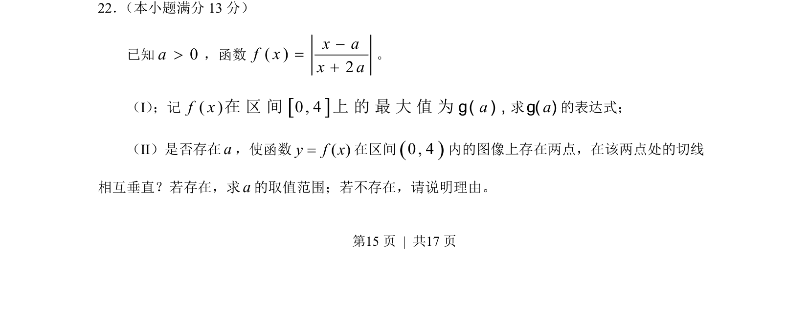
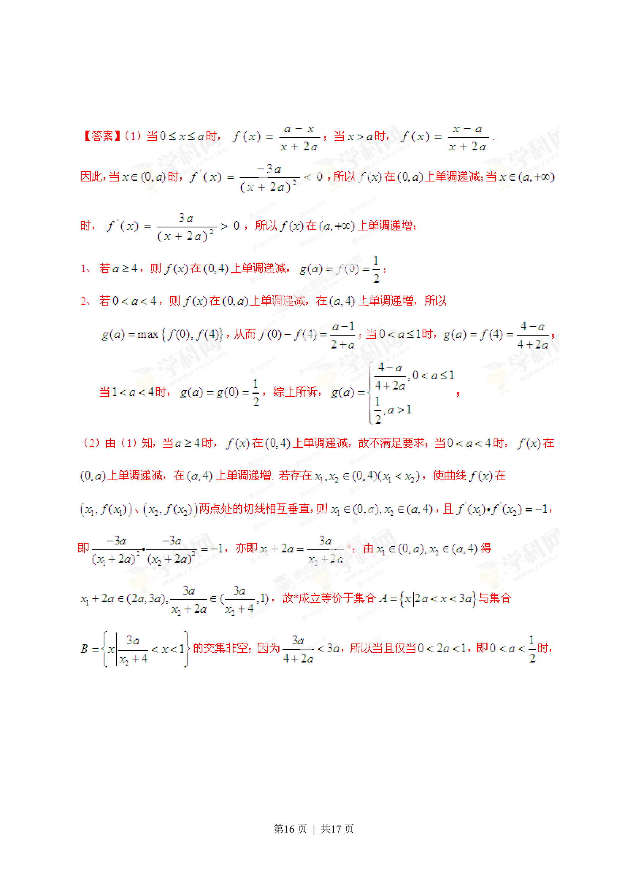
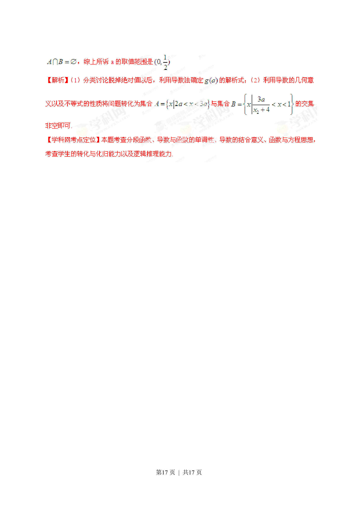

## 题面

## 摘要

本题主要考查含参分式函数在闭区间上的最值求解及利用导数研究函数图像上两点切线垂直的存在性问题。

## 关联考点

- [[419-函数最值-高中|函数最值]]
- [[839-导数几何意义|导数几何意义]]
- [[切线垂直]]
- [[721-参数取值范围|参数取值范围]]

## 答案与解析

> 📄 原 PDF 第 15 页：`素材/真题/湖南/2008-2024·（湖南）数学高考真题/2013年高考数学试卷（理）（湖南）（解析卷）.pdf`
