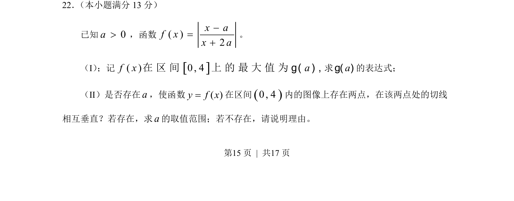
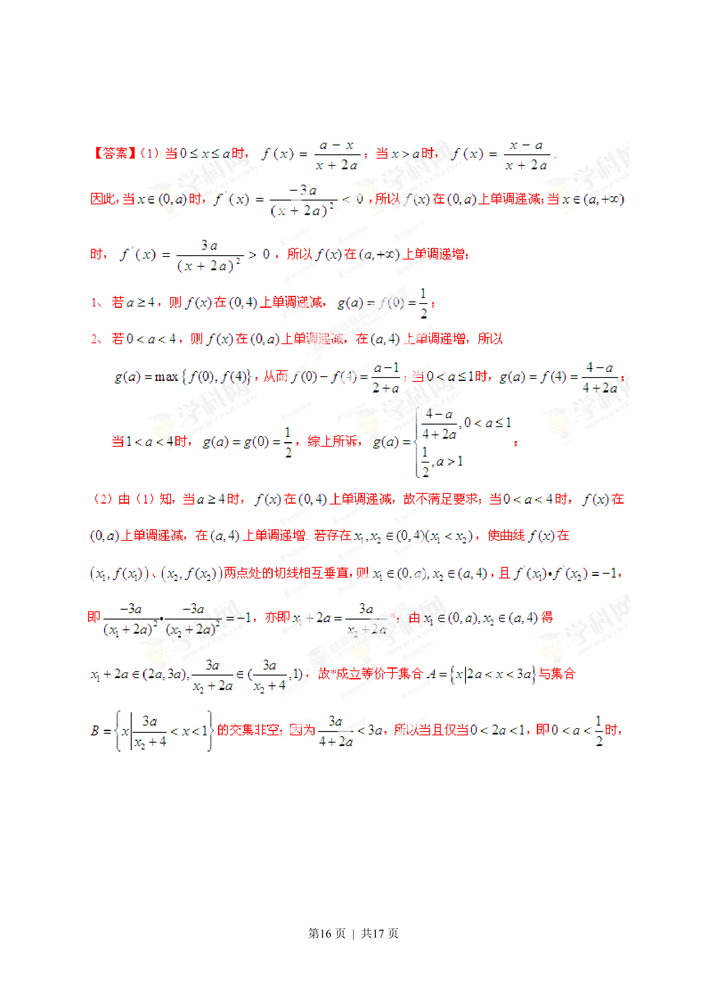
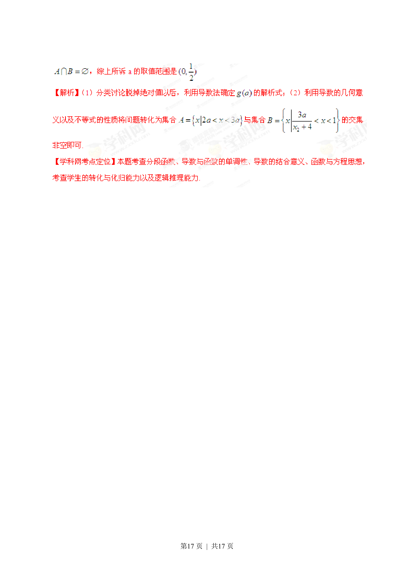

## 题面

## 摘要

本题主要考查含参分式函数在闭区间上的最值求解及利用导数研究函数图像上两点切线垂直的存在性问题。

## 关联考点

- [[419-函数最值-高中|函数最值]]
- [[440-导数的几何意义|导数几何意义]]
- [[切线垂直]]
- [[721-参数取值范围|参数取值范围]]

## 答案与解析

> 📄 原 PDF 第 15 页：`素材/真题/湖南/2008-2024·（湖南）数学高考真题/2013年高考数学试卷（理）（湖南）（解析卷）.pdf`

<!-- 题干文本-start -->
## 题干文本
22． （本小题满分13分）
已知0a>，函数( )2x af xx a-=+
。
（I） ；记 ( ) 0, 4f x a在区间上的最大值为g( ) ,求ag( )的表达式；
（II）是否存在a，使函数( )y f x=在区间0 , 4内的图像上存在两点，在该两点处的切线
相互垂直？若存在，求a的取值范围；若不存在，请说明理由。
<!-- 题干文本-end -->

<!-- 解析文本-start -->
## 解析文本

<!-- 解析文本-end -->
