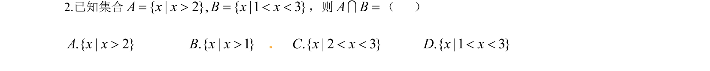

## 题面

## 摘要

本题主要考查集合交集的定义及运算，通过求解公共元素得出答案。

## 关联考点

- [[1139-集合的交集|集合交集]]

## 答案与解析

> 📄 原 PDF 第 1 页：`素材/真题/湖南/2008-2024·（湖南）数学高考真题/2014年高考数学试卷（文）（湖南）（解析卷）.pdf`

<!-- 题干文本-start -->
## 题干文本
2.已知集合{ | 2}, { |1 3}A x x B x x= > = < <，则A B=I（   ）
.{ | 2}A x x>        .{ | 1 }B x x>     .{ | 2 3}C x x< <      .{ |1 3}D x x< <
<!-- 题干文本-end -->

<!-- 解析文本-start -->
## 解析文本
【答案】C[来源:学&科&网]
【解析】由交集的定义可得/ 2 3A B x x= < <I,故选C.
【考点定位】集合交集
<!-- 解析文本-end -->
