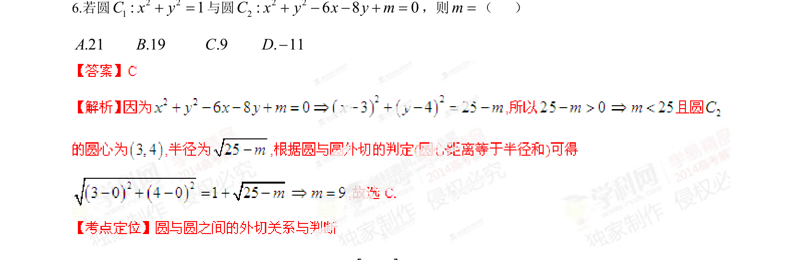

## 题面

## 摘要

两圆方程分别为 x^2+y^2=1 和 x^2+y^2-6x-8y+m=0，通过圆心距与半径关系求参数 m

## 关联考点

- [[373-圆的标准方程|圆的标准方程]]
- [[1283-圆与圆的位置关系|圆与圆的位置关系]]

## 答案与解析

> 📄 原 PDF 第 2 页：`素材/真题/湖南/2008-2024·（湖南）数学高考真题/2014年高考数学试卷（文）（湖南）（解析卷）.pdf`
