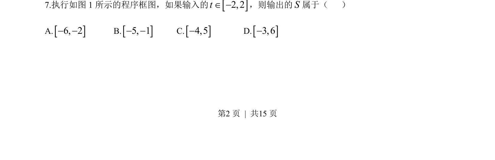
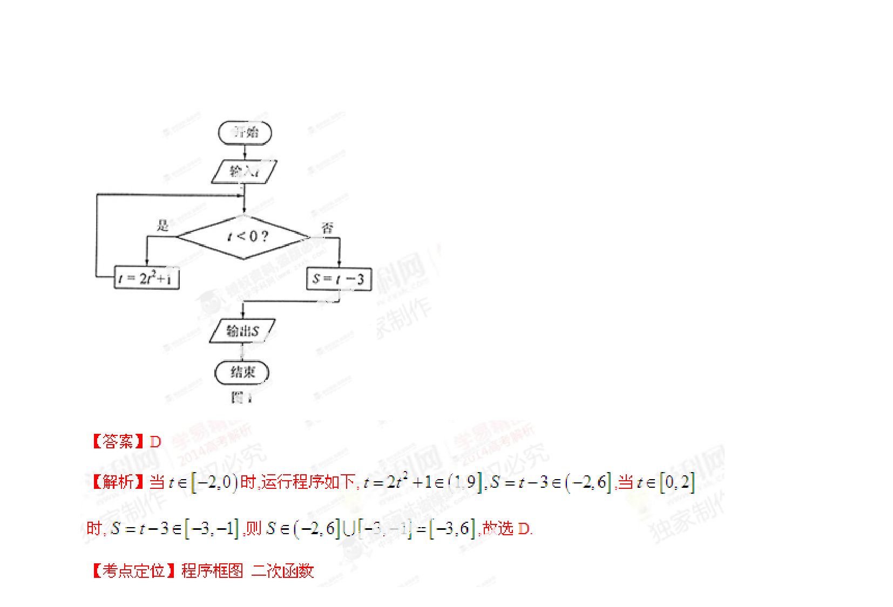

## 题面

## 摘要

该题考查含条件分支的程序框图，根据输入t的分段定义计算输出S的值域。

## 关联考点

- [[1042-程序框图|程序框图]]
- [[290-分段函数|分段函数]]
- [[676-函数值域|函数值域]]

## 答案与解析

> 📄 原 PDF 第 2 页：`素材/真题/湖南/2008-2024·（湖南）数学高考真题/2014年高考数学试卷（文）（湖南）（解析卷）.pdf`
