## 题面

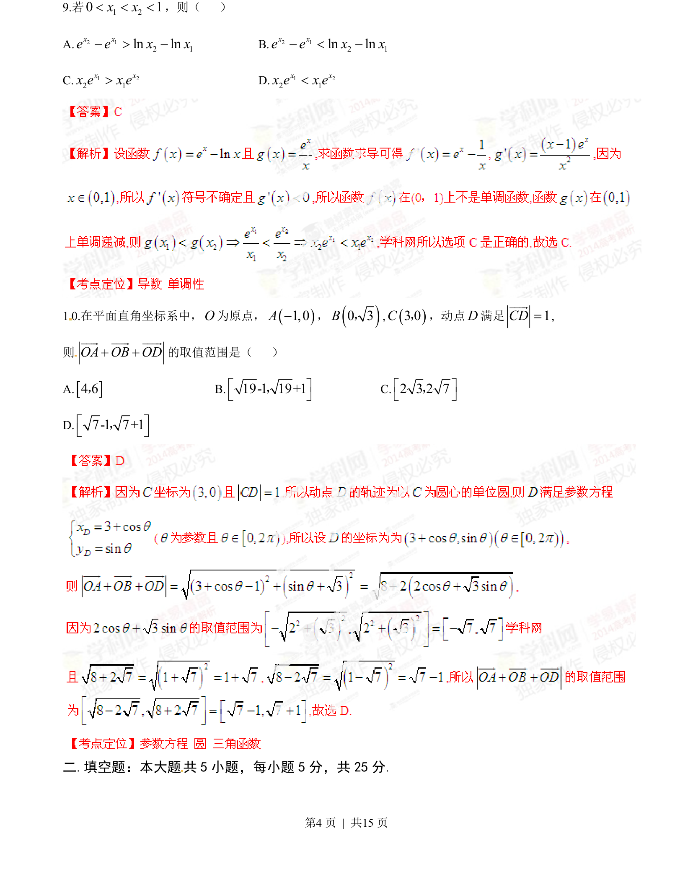
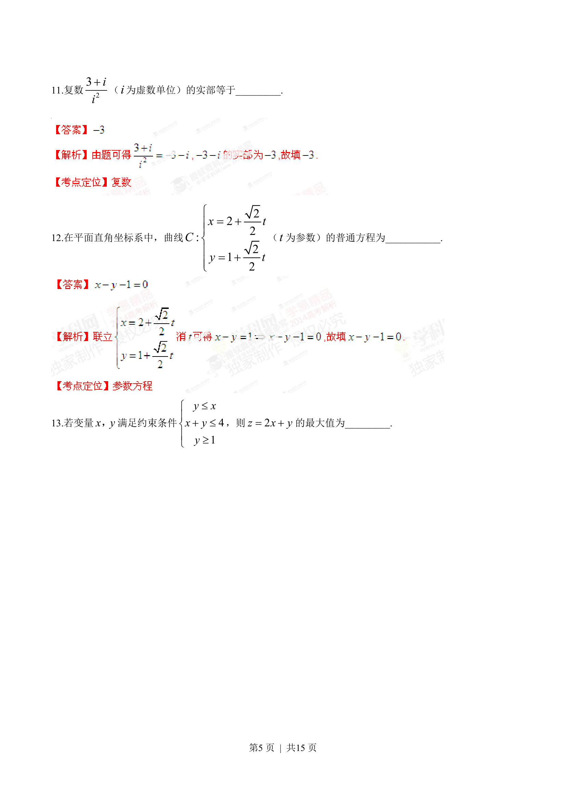
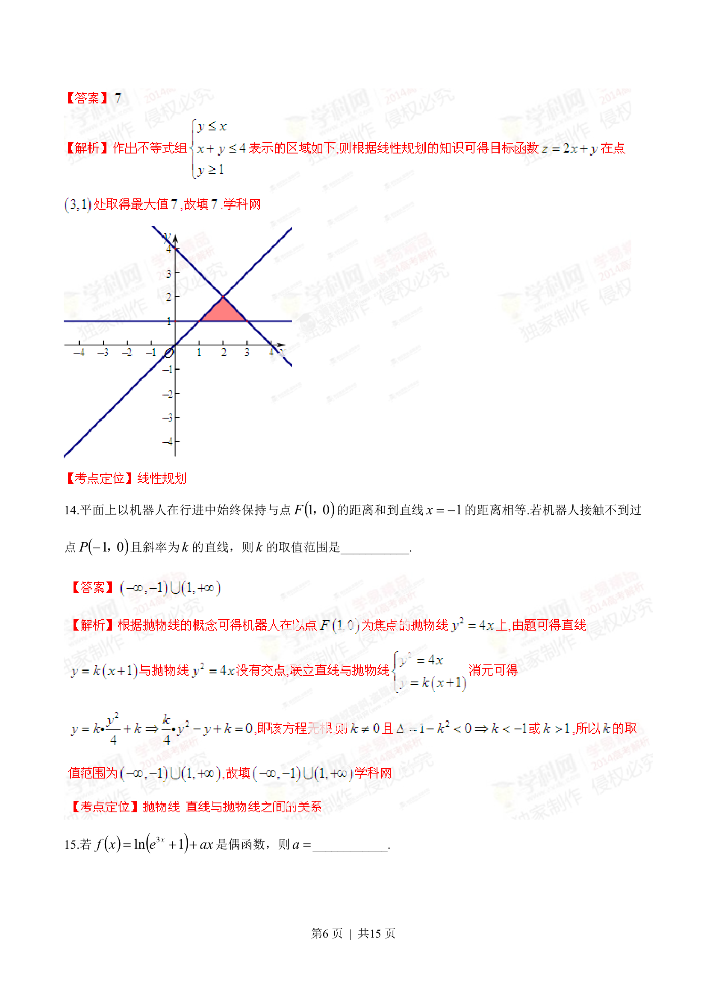
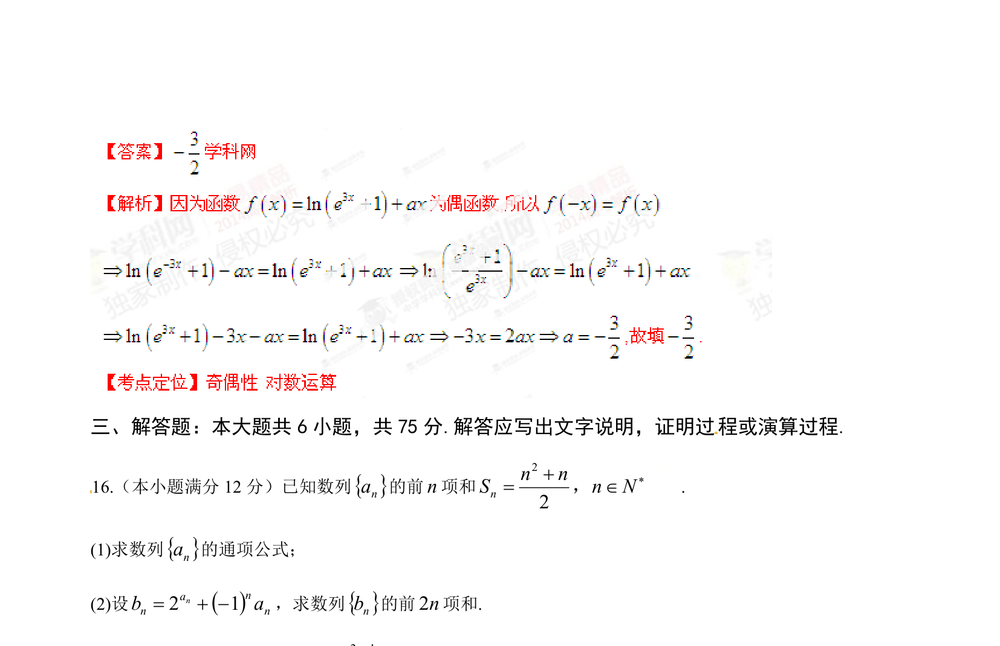

## 摘要

考查利用导数研究函数单调性解不等式比较大小问题

## 关联考点

- [[1292-导数的应用|导数应用]]
- [[432-导数与函数单调性|函数单调性]]
- [[指数对数函数]]
- [[622-不等式比较|不等式比较]]

## 答案与解析

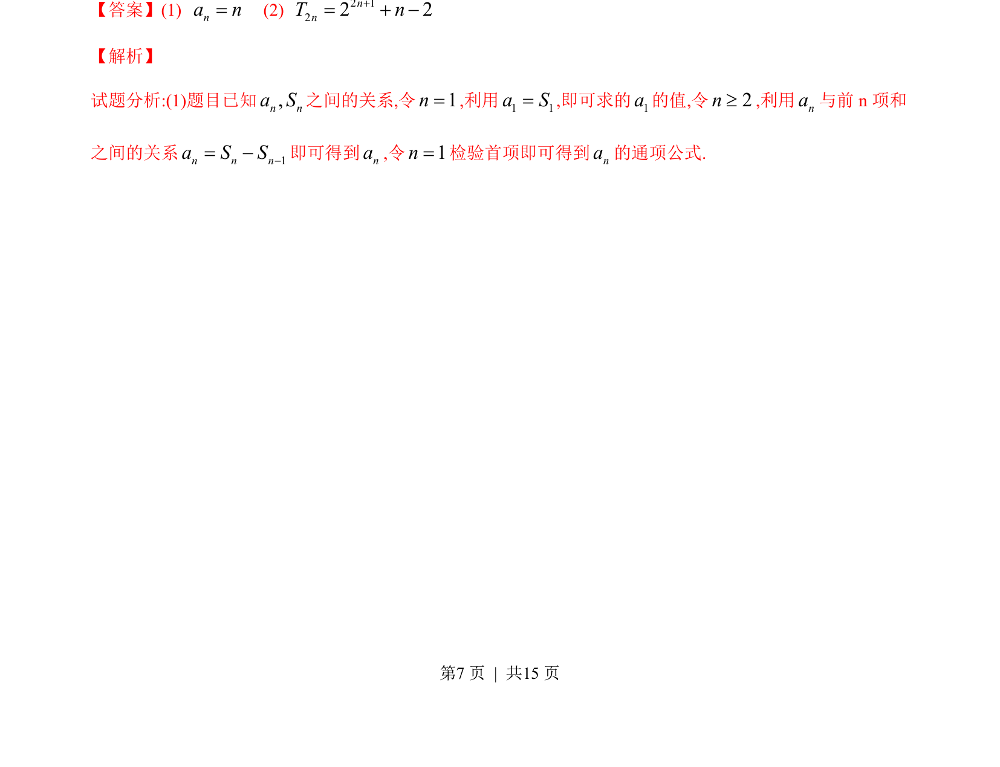
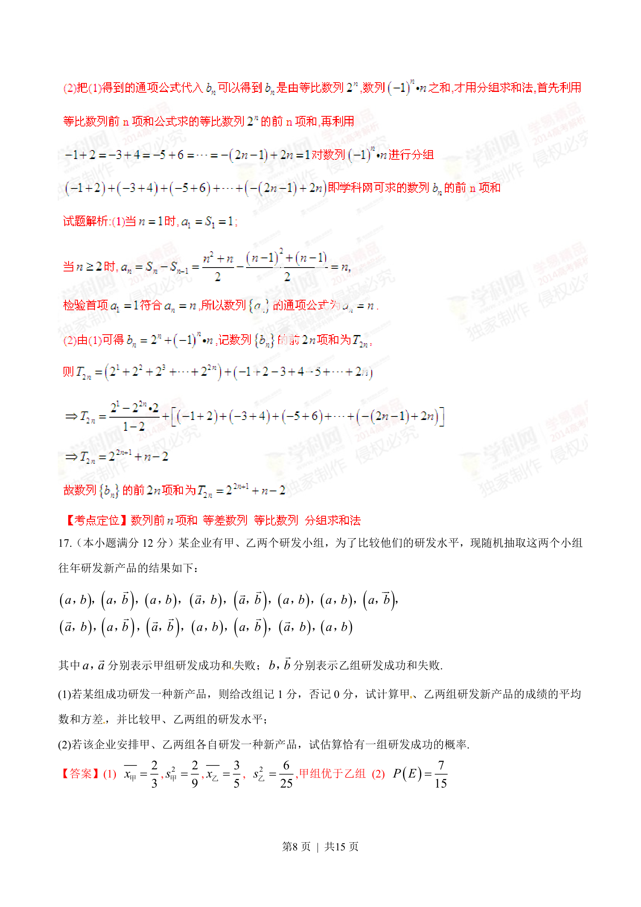
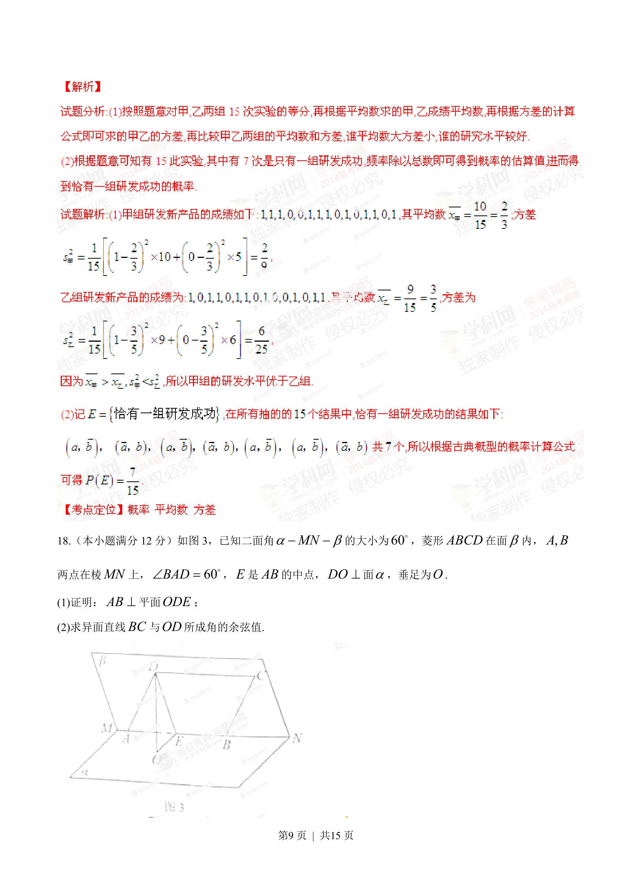
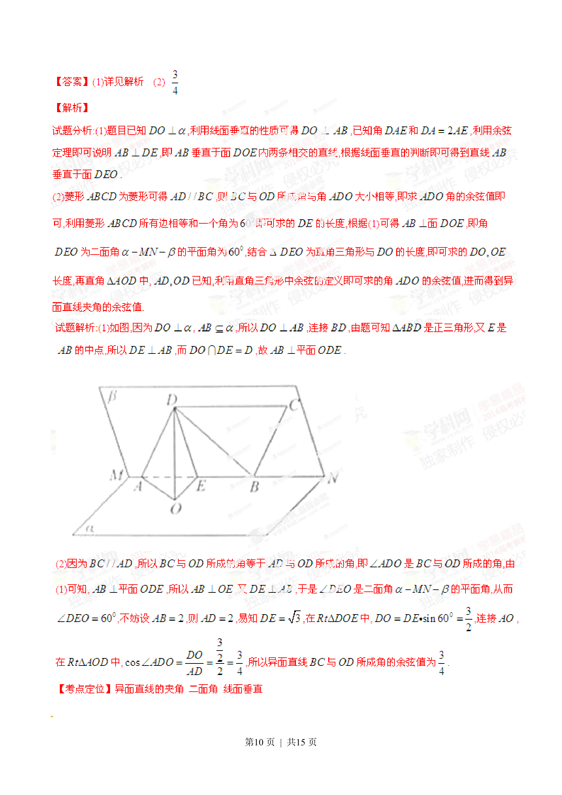
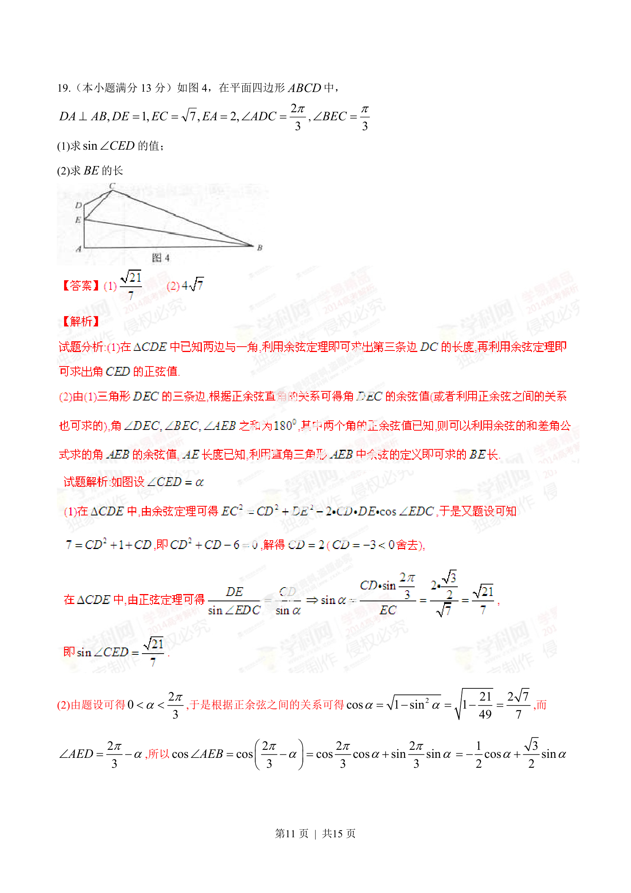
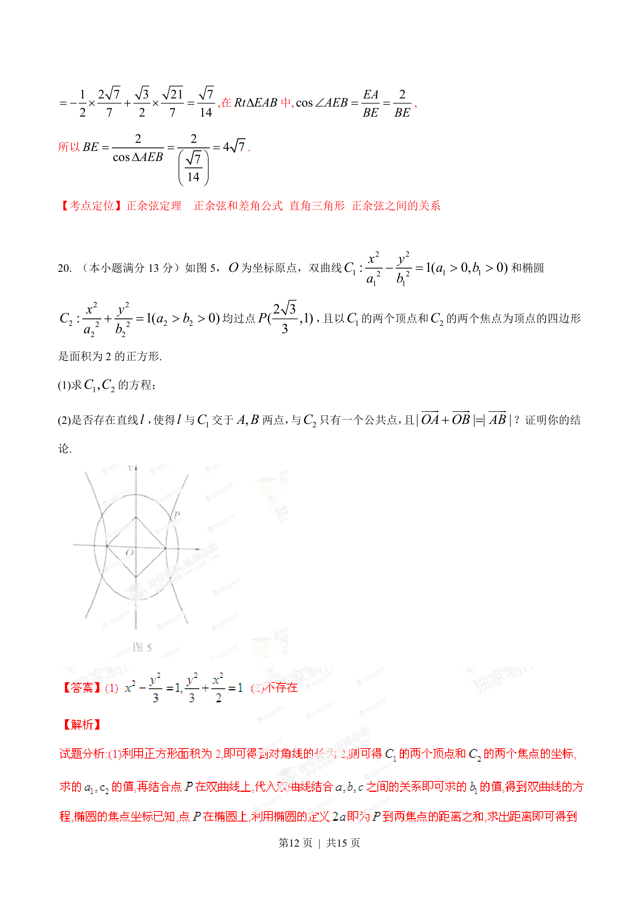
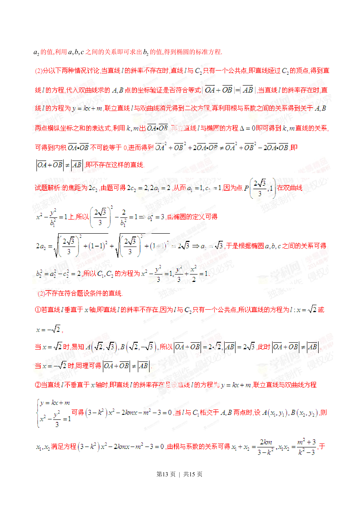
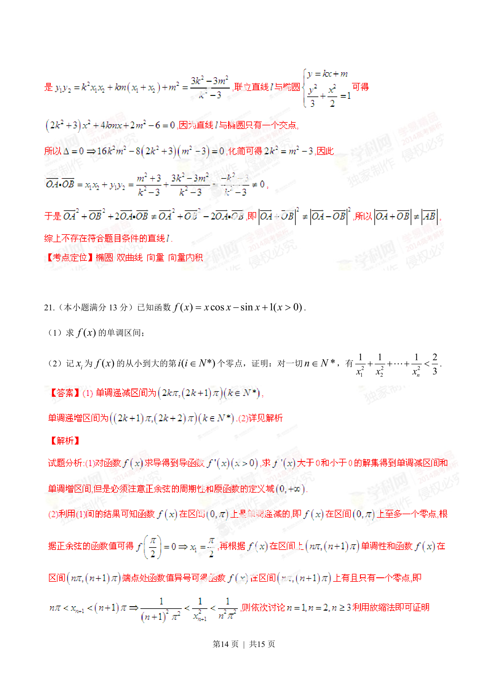
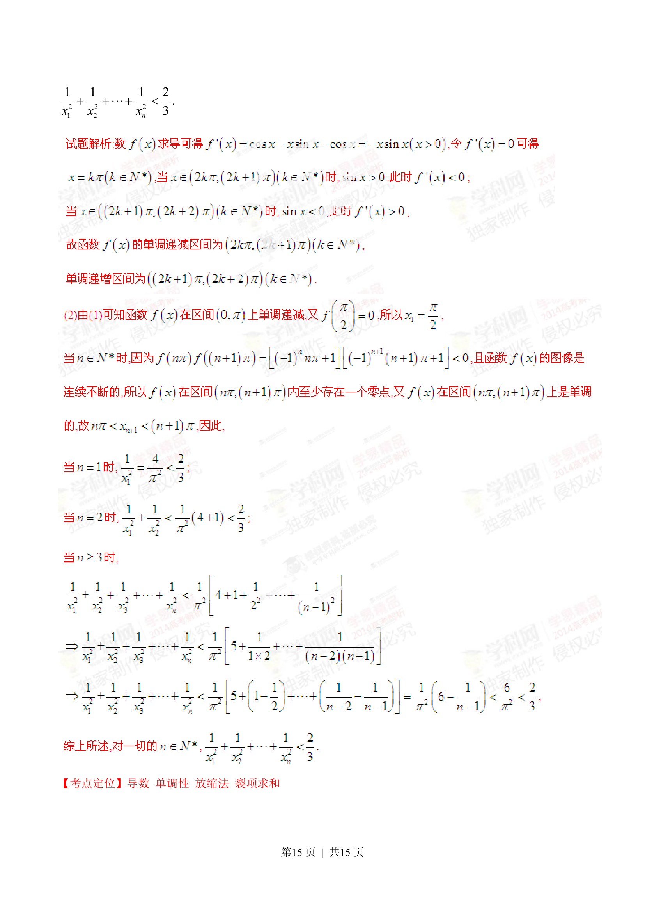

> 📄 原 PDF 第 4 页：`素材/真题/湖南/2008-2024·（湖南）数学高考真题/2014年高考数学试卷（文）（湖南）（解析卷）.pdf`
