## 题面

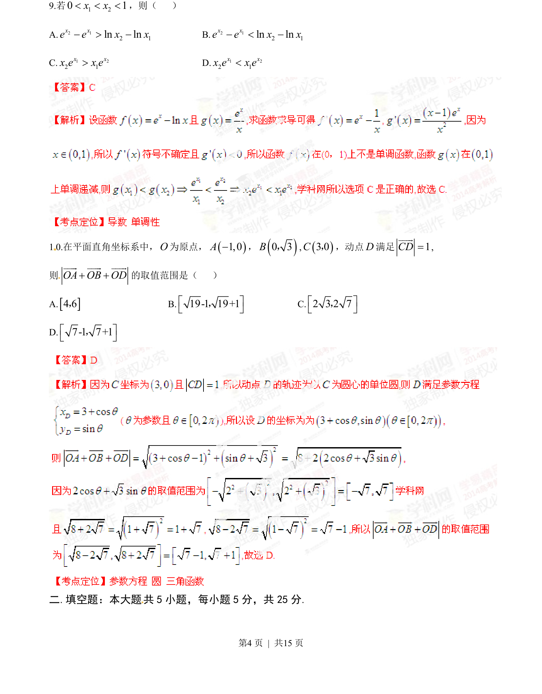
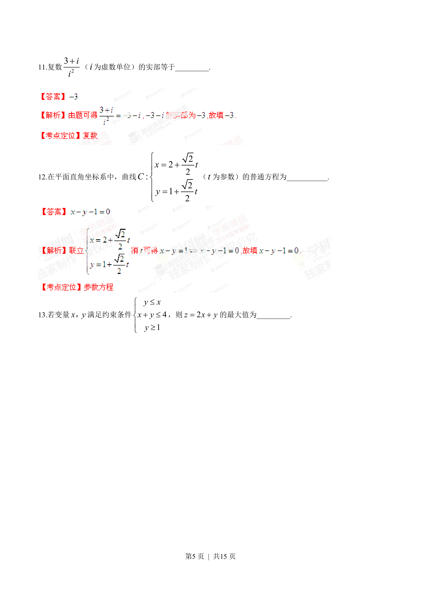
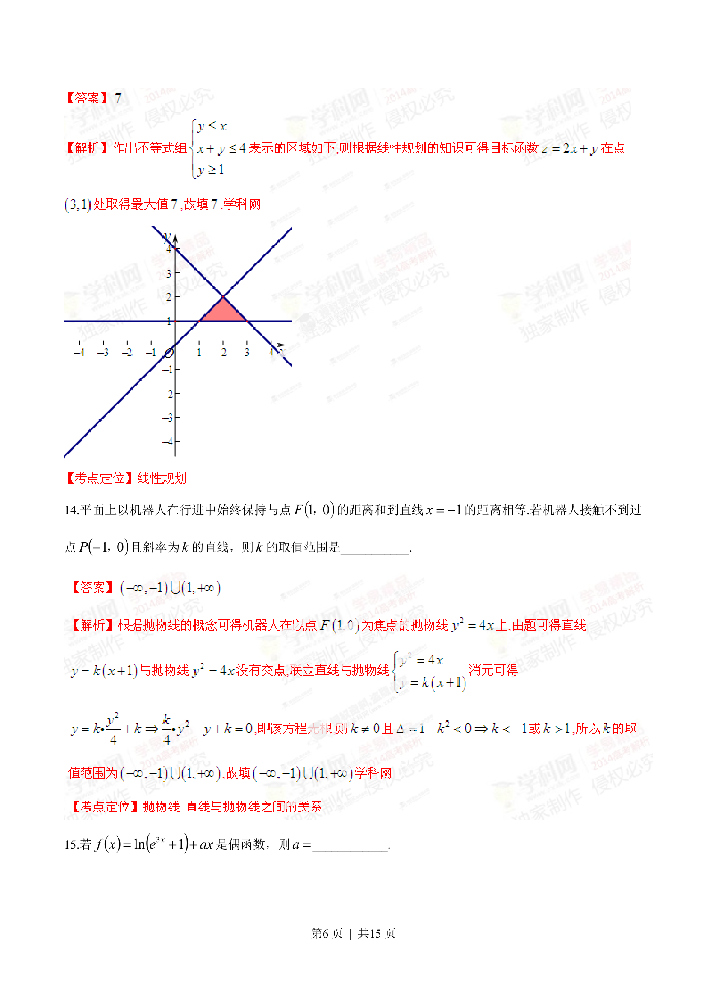
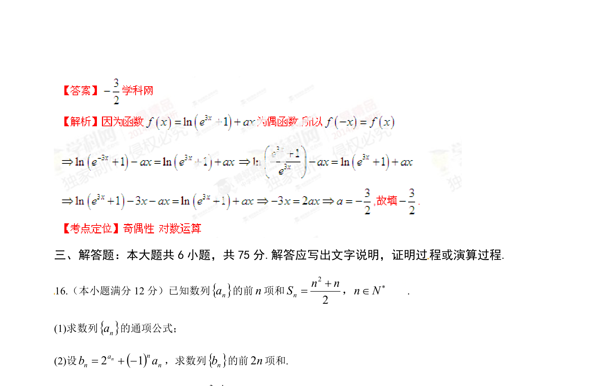

## 摘要

考查利用导数研究函数单调性解不等式比较大小问题

## 关联考点

- [[1292-导数的应用|导数应用]]
- [[432-导数与函数单调性|函数单调性]]
- [[指数对数函数]]
- [[622-不等式比较|不等式比较]]

## 答案与解析

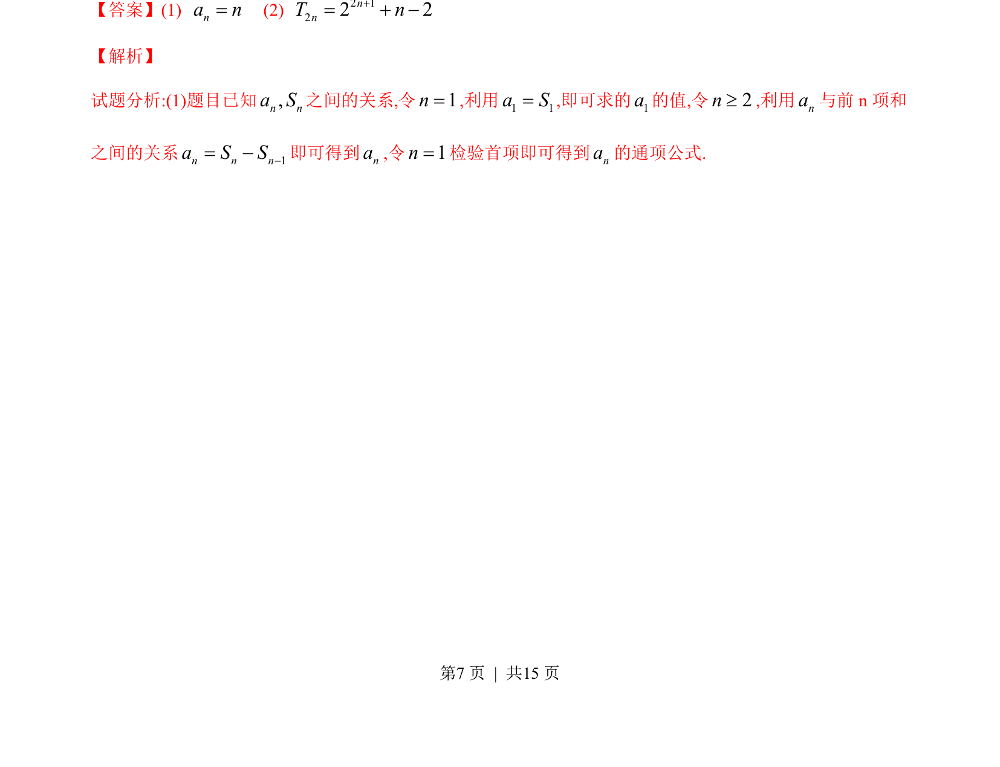
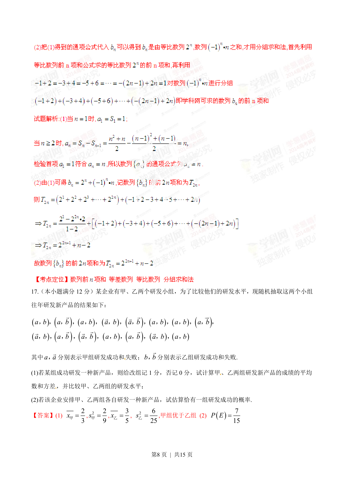
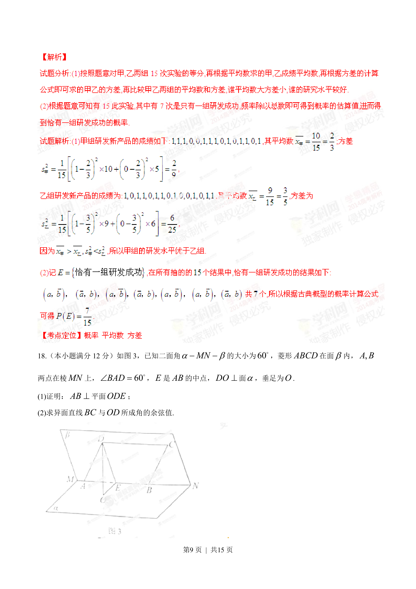
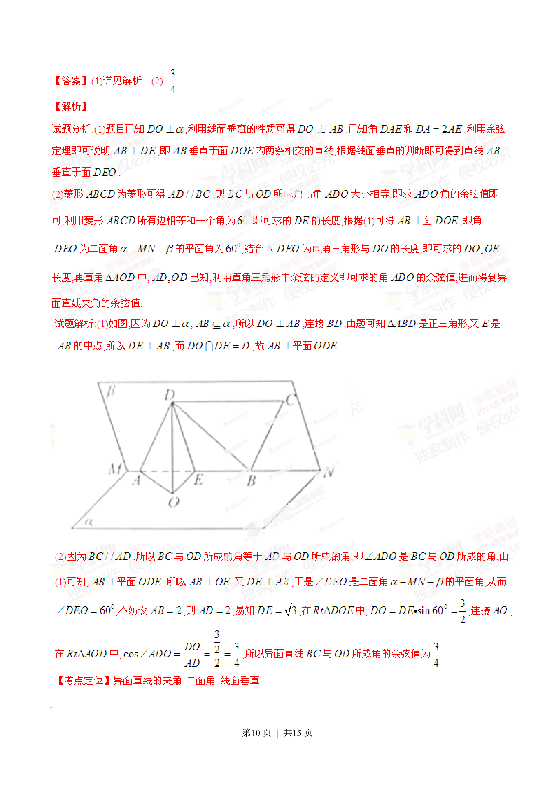
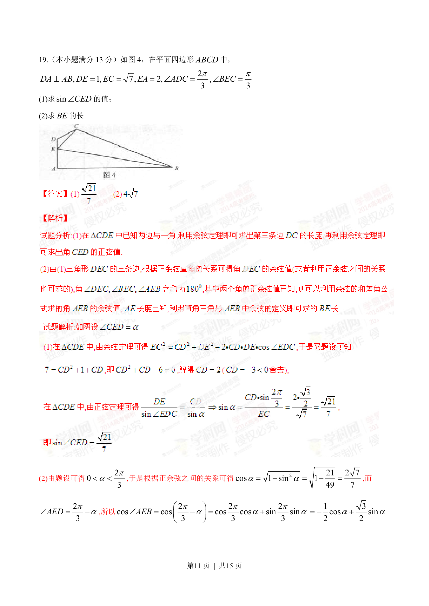
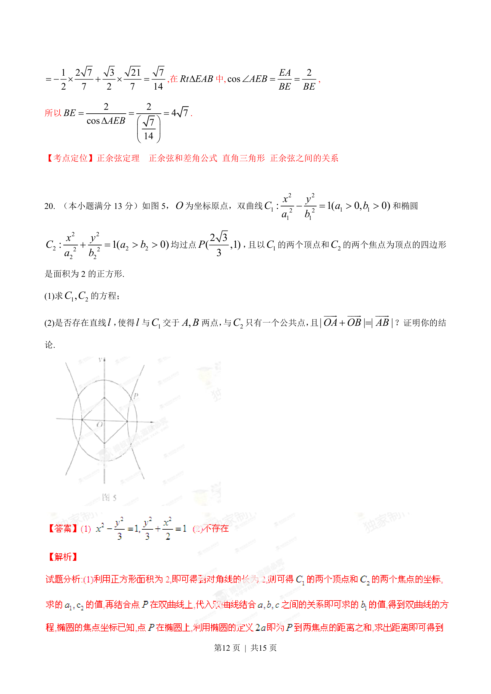
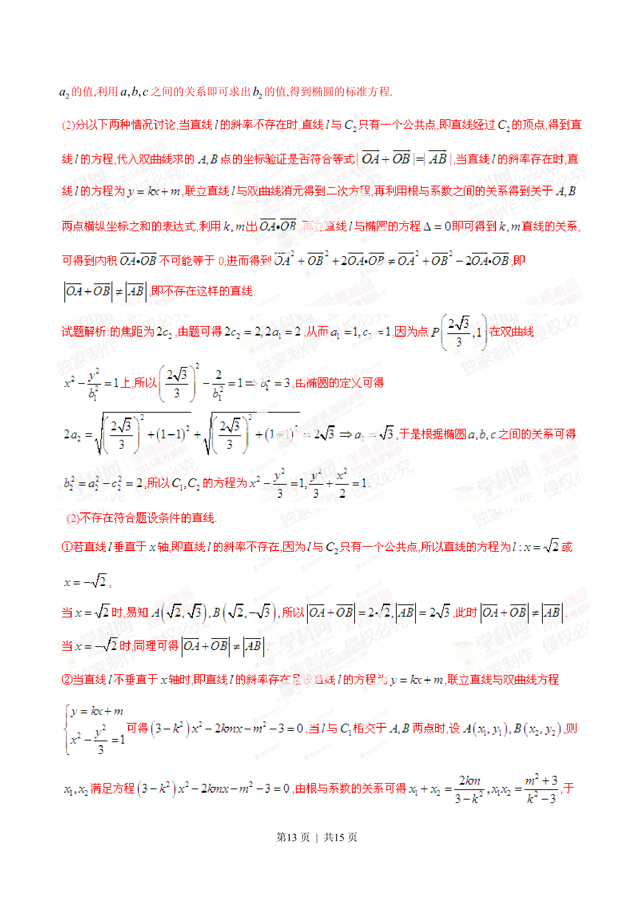
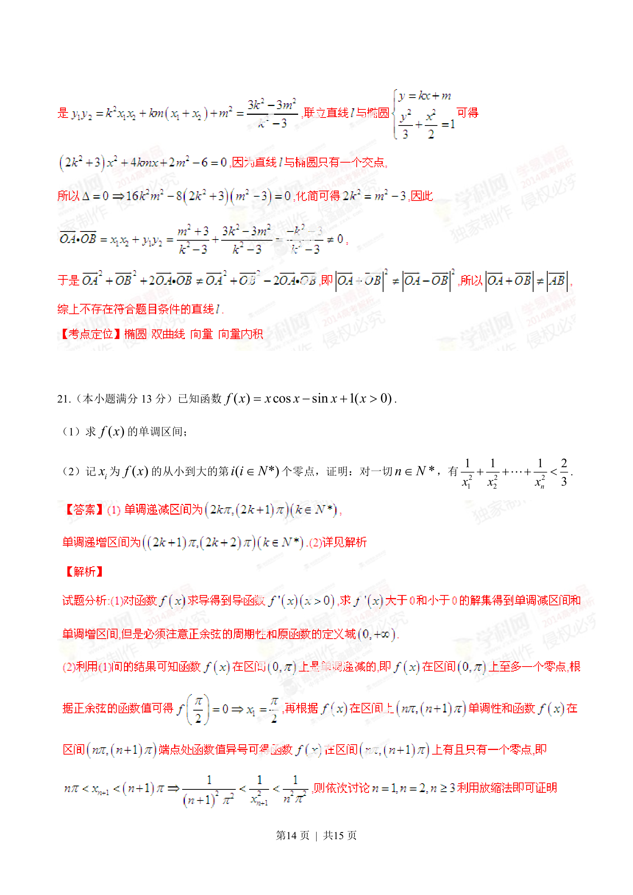
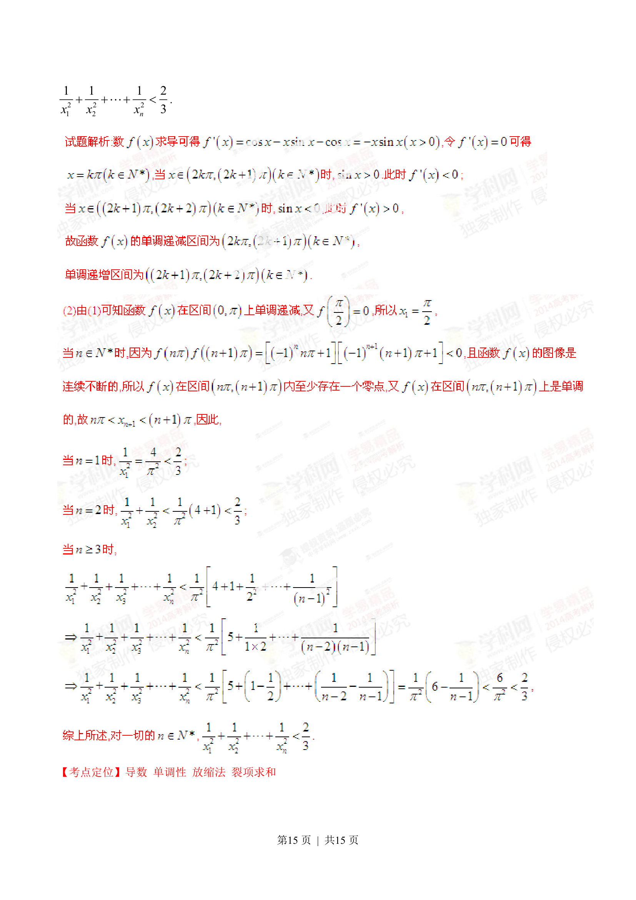

> 📄 原 PDF 第 4 页：`素材/真题/湖南/2008-2024·（湖南）数学高考真题/2014年高考数学试卷（文）（湖南）（解析卷）.pdf`

<!-- 题干文本-start -->
## 题干文本
9.若1201xx<<<，则（   ）
A.2121lnlnxxeexx->-B.2121lnlnxxeexx-<-
C.1221xxxexe>    D. 1221xxxexe<
1 0.在平面直角坐标系中，O为原点，1,0A-，03B，,30C，，动点D满足1CD=
,[来源:学_科_网Z_X_X_K]
则OAOBOD++
的取值范围是（   ）
A.46，                  B. 19-119+1，C.2327，             
D.7-17+1，[来源:学|科|网Z|X|X|K]
二.填空题：本大题共5小题，每小题5分，共25分.
<!-- 题干文本-end -->

<!-- 解析文本-start -->
## 解析文本

<!-- 解析文本-end -->
