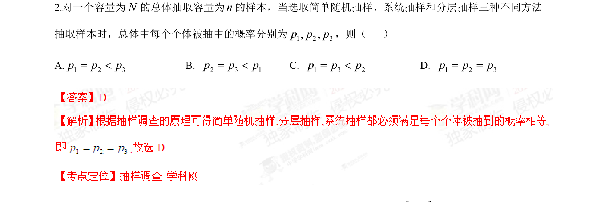

## 题面

## 摘要

考查简单随机抽样、系统抽样和分层抽样中个体被抽中的概率比较。

## 关联考点

- [[881-抽样方法|抽样方法]]
- [[等概率抽样]]
- [[362-随机抽样-简单|简单随机抽样]]
- [[系统抽样]]
- [[319-分层抽样|分层抽样]]

## 答案与解析

> 📄 原 PDF 第 1 页：`素材/真题/湖南/2008-2024·（湖南）数学高考真题/2014年高考数学试卷（理）（湖南）（解析卷）.pdf`
