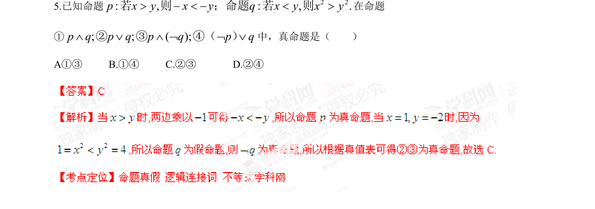

## 题面

## 摘要

考查根据不等式性质判定命题真假，并运用逻辑联结词判断复合命题的真伪。

## 关联考点

- [[765-命题真假判断|命题真假判断]]
- [[复合命题真值表]]
- [[117-不等式性质|不等式性质]]

## 答案与解析

> 📄 原 PDF 第 2 页：`素材/真题/湖南/2008-2024·（湖南）数学高考真题/2014年高考数学试卷（理）（湖南）（解析卷）.pdf`
