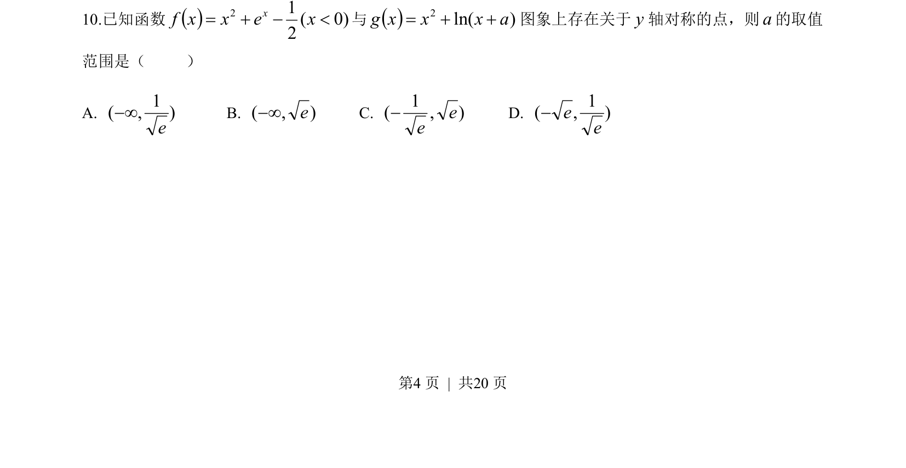
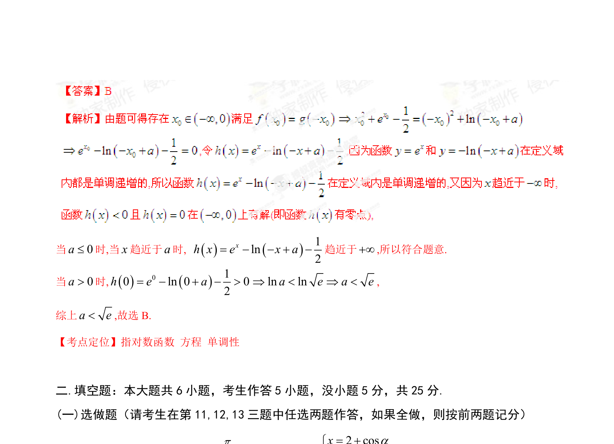

## 题面

## 摘要

函数 f(x) 与 g(x) 图象存在关于 y 轴对称的点，转化为方程有解求参数 a 的范围。

## 关联考点

- [[函数图像的对称性]]
- [[1263-函数与方程|函数与方程]]
- [[导数求参数范围]]
- [[对数函数与指数函数]]

## 答案与解析

> 📄 原 PDF 第 4 页：`素材/真题/湖南/2008-2024·（湖南）数学高考真题/2014年高考数学试卷（理）（湖南）（解析卷）.pdf`
