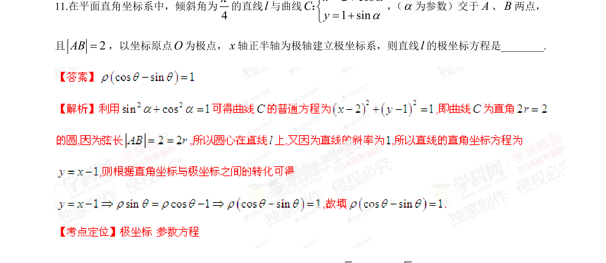

## 题面

## 摘要

参数方程与极坐标综合，由直线与曲线相交弦长求直线的极坐标方程。

## 关联考点

- [[061-方程|参数方程]]
- [[921-极坐标方程|极坐标方程]]
- [[866-弦长|弦长]]
- [[1026-直线方程|直线方程]]

## 答案与解析

> 📄 原 PDF 第 5 页：`素材/真题/湖南/2008-2024·（湖南）数学高考真题/2014年高考数学试卷（理）（湖南）（解析卷）.pdf`
