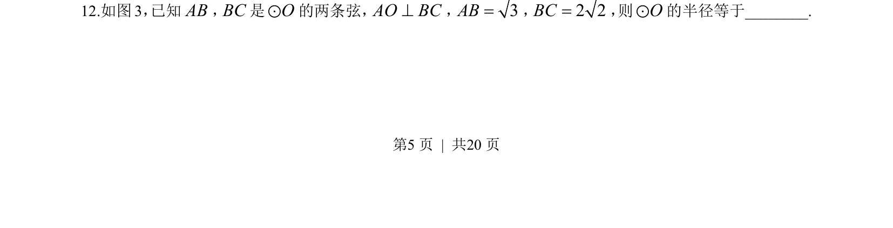
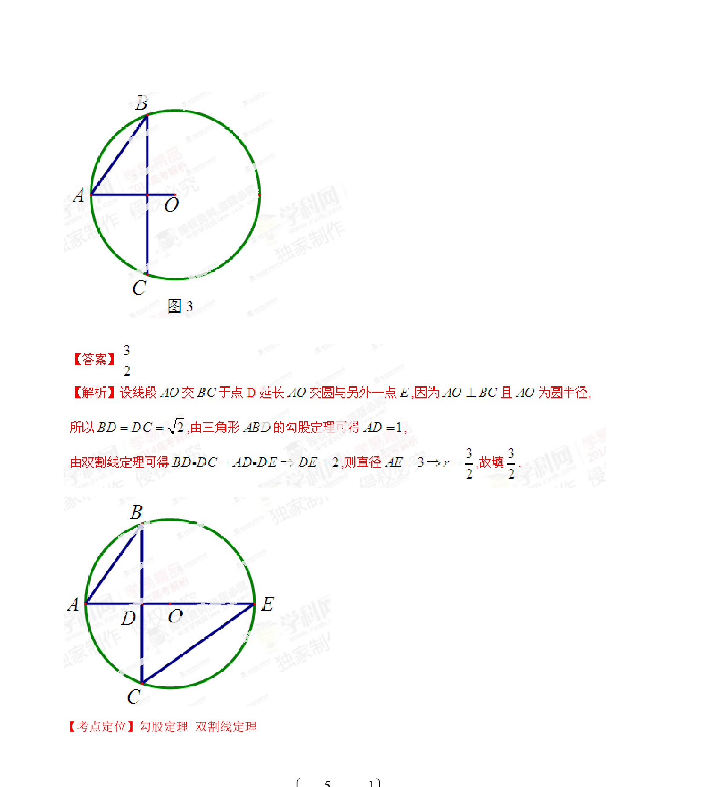

## 题面

## 摘要

已知圆的弦长及垂直关系，利用垂径定理和勾股定理求半径

## 关联考点

- [[781-圆的性质|圆的性质]]
- [[224-垂径定理|垂径定理]]
- [[189-勾股定理|勾股定理]]

## 答案与解析

> 📄 原 PDF 第 5 页：`素材/真题/湖南/2008-2024·（湖南）数学高考真题/2014年高考数学试卷（理）（湖南）（解析卷）.pdf`
