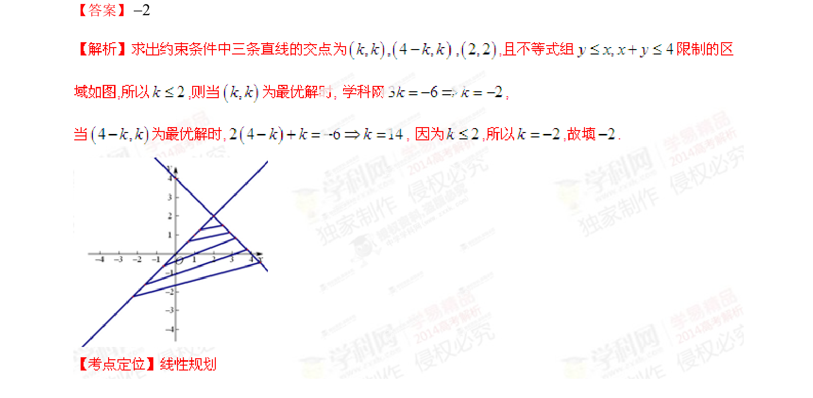

## 题面

## 摘要

该题考查含参约束条件下的线性规划问题，通过目标函数最小值反求参数值。

## 关联考点

- [[1074-简单线性规划|线性规划]]
- [[含参约束]]
- [[1000-目标函数最值|目标函数最值]]

## 答案与解析

> 📄 原 PDF 第 7 页：`素材/真题/湖南/2008-2024·（湖南）数学高考真题/2014年高考数学试卷（理）（湖南）（解析卷）.pdf`
