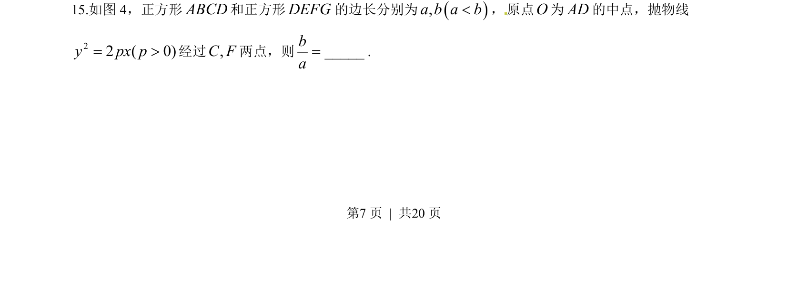
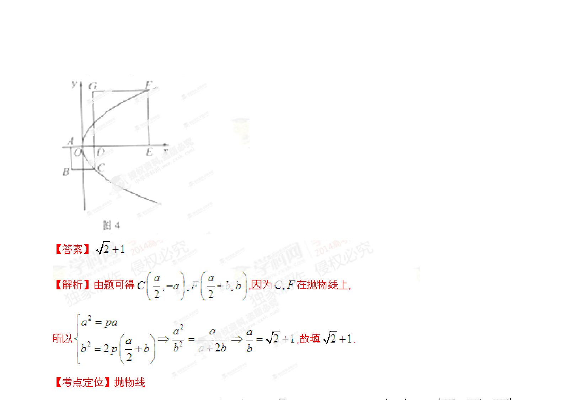

## 题面

## 摘要

本题考查抛物线标准方程与正方形几何性质的综合应用，通过建立坐标系求解边长比值。

## 关联考点

- [[880-抛物线的标准方程|抛物线的标准方程]]
- [[968-正方形性质|正方形性质]]
- [[788-坐标运算|坐标运算]]

## 答案与解析

> 📄 原 PDF 第 7 页：`素材/真题/湖南/2008-2024·（湖南）数学高考真题/2014年高考数学试卷（理）（湖南）（解析卷）.pdf`
