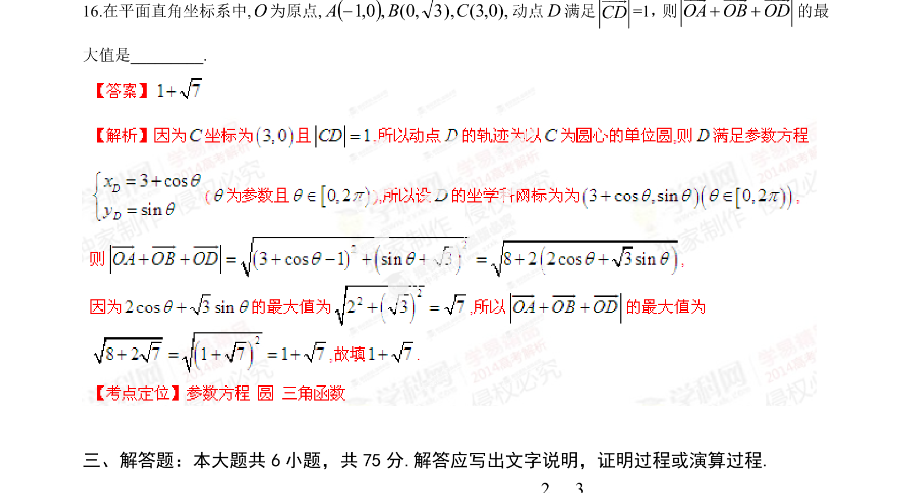

## 题面

## 摘要

已知动点D满足|CD|=1，求向量OA+OB+OD的模的最大值。

## 关联考点

- [[752-向量模长|向量模长]]
- [[782-圆的方程|圆的方程]]
- [[061-方程|参数方程]]
- [[距离最值]]

## 答案与解析

> 📄 原 PDF 第 8 页：`素材/真题/湖南/2008-2024·（湖南）数学高考真题/2014年高考数学试卷（理）（湖南）（解析卷）.pdf`
