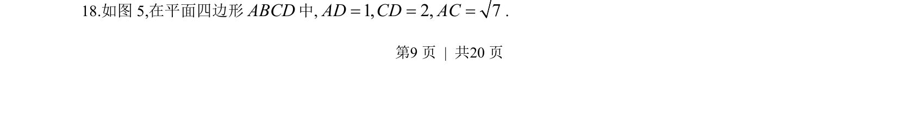
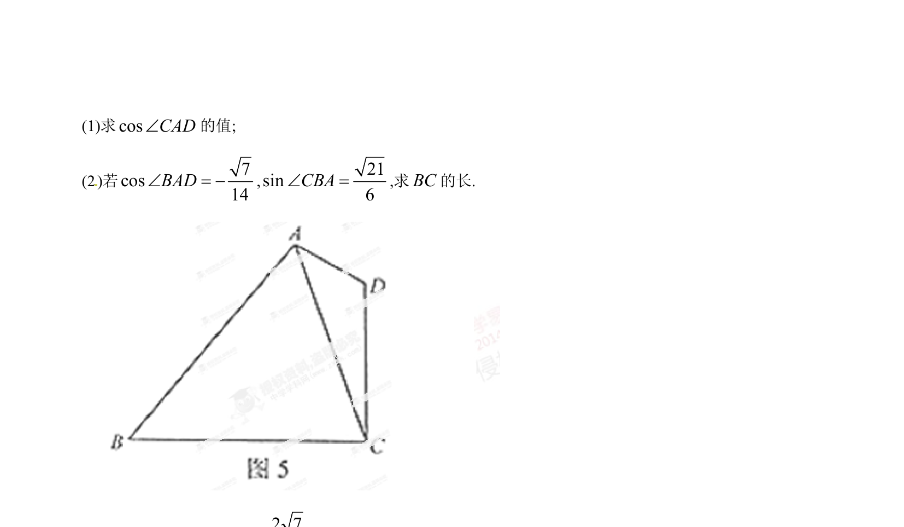
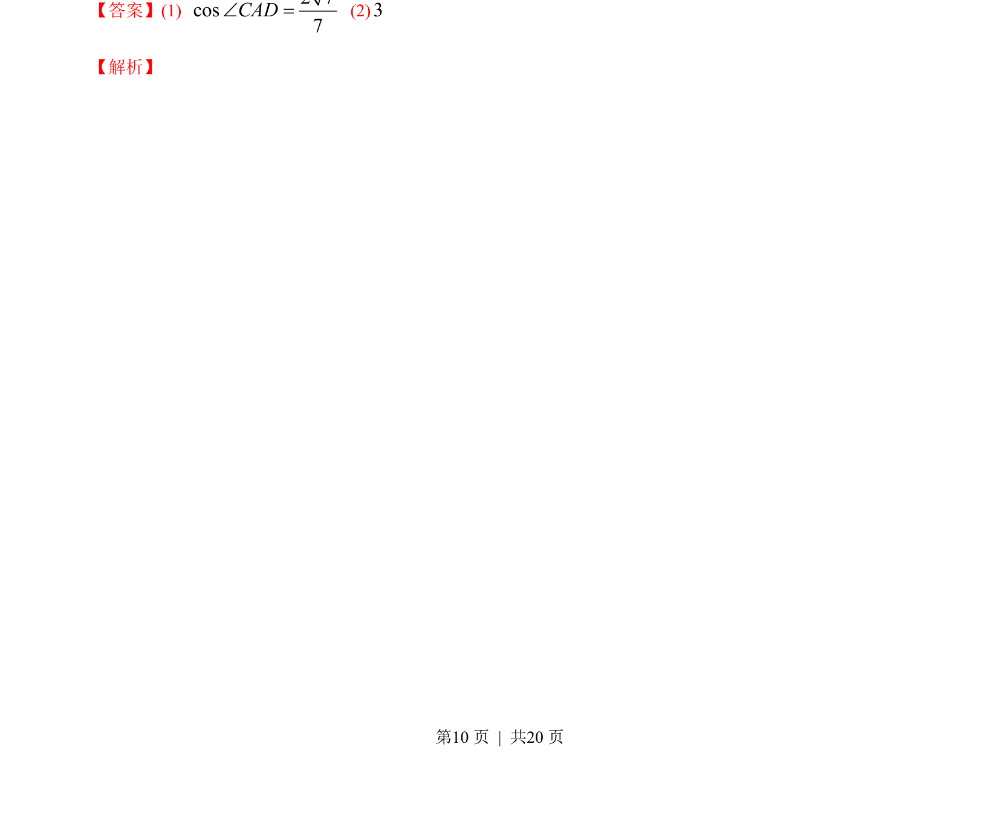
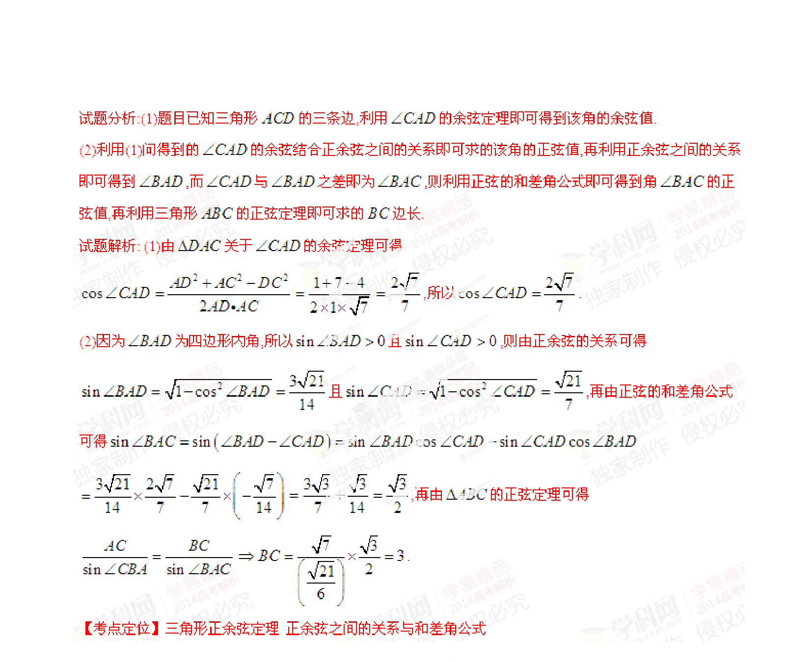

## 题面

## 摘要

四棱柱线面垂直证明与二面角余弦值计算。

## 关联考点

- [[1086-线面垂直的判定与性质|线面垂直]]
- [[353-空间角|二面角]]
- [[189-勾股定理|勾股定理]]
- [[013-形状-菱形|菱形]]

## 答案与解析

> 📄 原 PDF 第 9 页：`素材/真题/湖南/2008-2024·（湖南）数学高考真题/2014年高考数学试卷（理）（湖南）（解析卷）.pdf`
