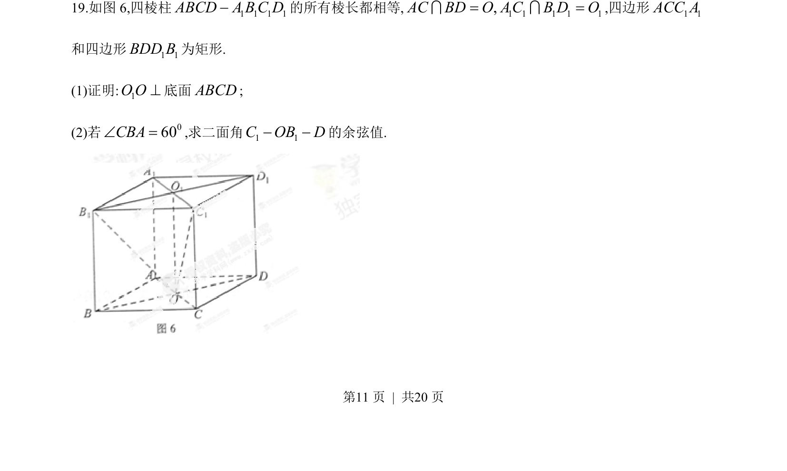
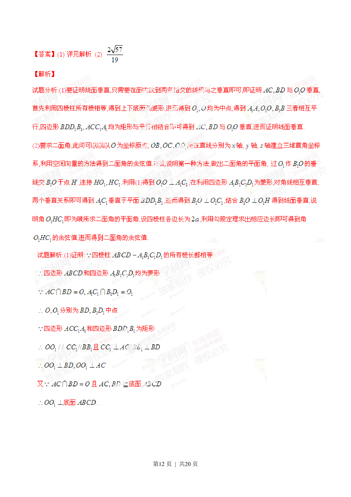
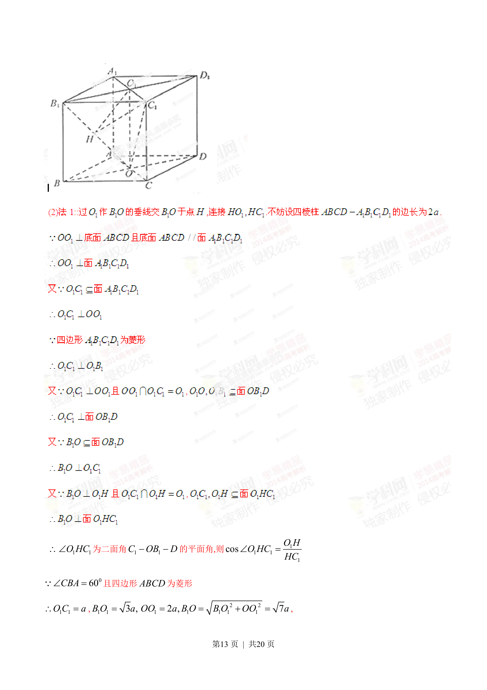
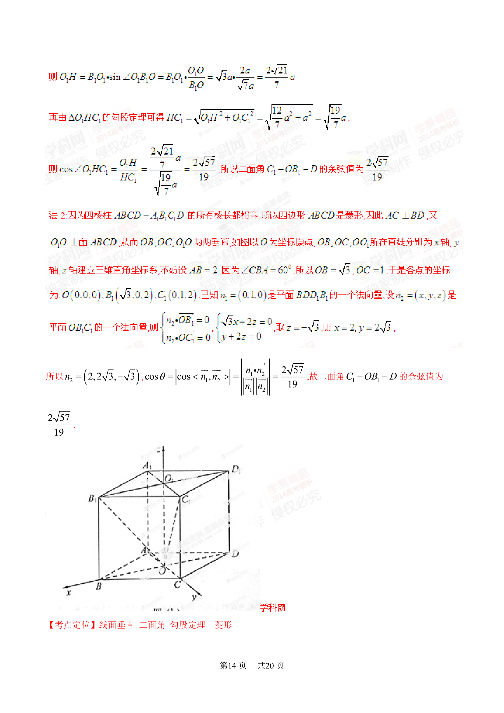

## 题面

## 摘要

考查四棱柱中的线面垂直证明与给定二面角的余弦值计算。

## 关联考点

- [[1355-线面垂直判定|线面垂直判定]]
- [[353-空间角|二面角]]
- [[579-空间向量法|空间向量法]]

## 答案与解析

> 📄 原 PDF 第 11 页：`素材/真题/湖南/2008-2024·（湖南）数学高考真题/2014年高考数学试卷（理）（湖南）（解析卷）.pdf`
