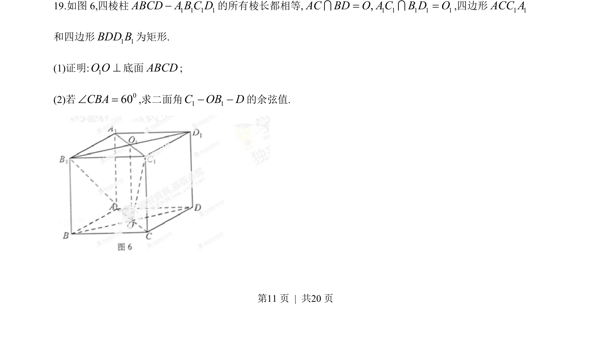
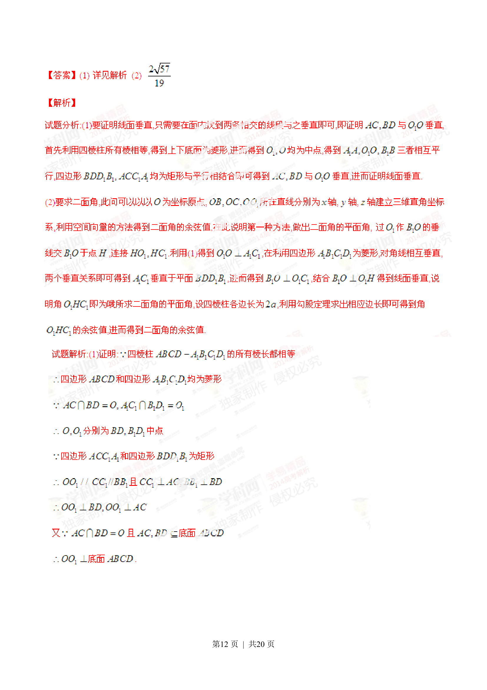
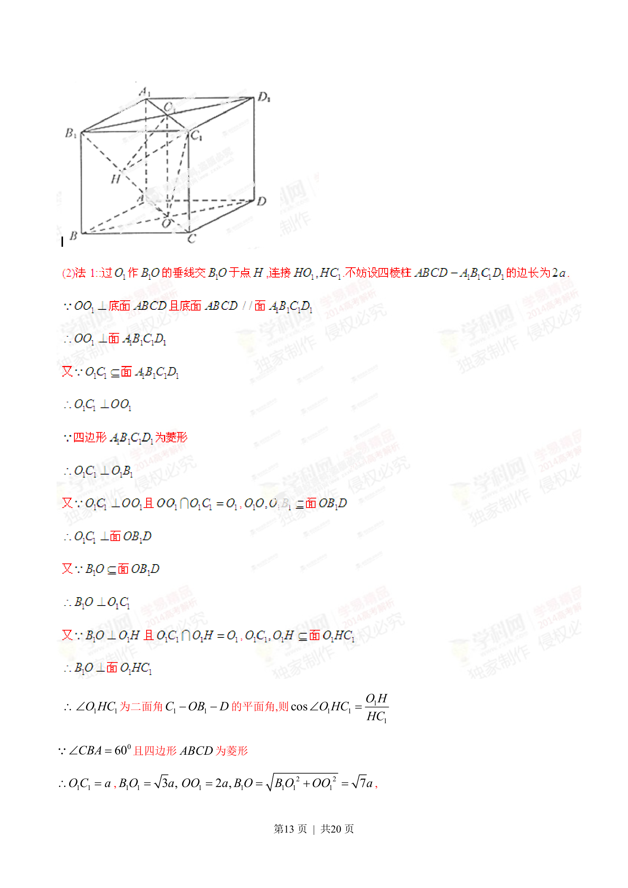
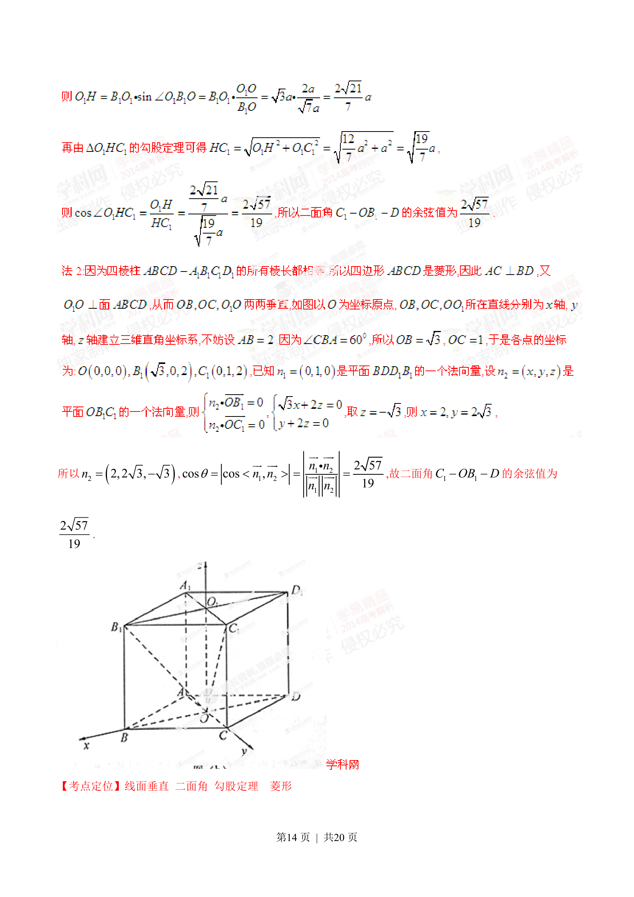

## 题面

## 摘要

考查四棱柱中的线面垂直证明与给定二面角的余弦值计算。

## 关联考点

- [[1085-线面垂直的判定|线面垂直判定]]
- [[353-空间角|二面角]]
- [[579-空间向量法|空间向量法]]

## 答案与解析

> 📄 原 PDF 第 11 页：`素材/真题/湖南/2008-2024·（湖南）数学高考真题/2014年高考数学试卷（理）（湖南）（解析卷）.pdf`

<!-- 题干文本-start -->
## 题干文本
19.如图6,四棱柱 1 1 1 1ABCD A B C D−的所有棱长都相等, 1 1 1 1 1,AC BD O A C B D O= =I I,四边形1 1ACC A
和四边形1 1BDD B为矩形.
(1)证明:1O O^底面ABCD;
(2)若 060CBAÐ =,求二面角1 1C OB D− −的余弦值.
<!-- 题干文本-end -->

<!-- 解析文本-start -->
## 解析文本

<!-- 解析文本-end -->
