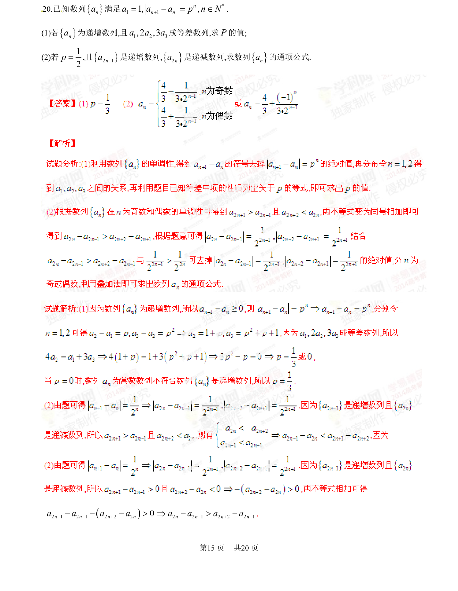
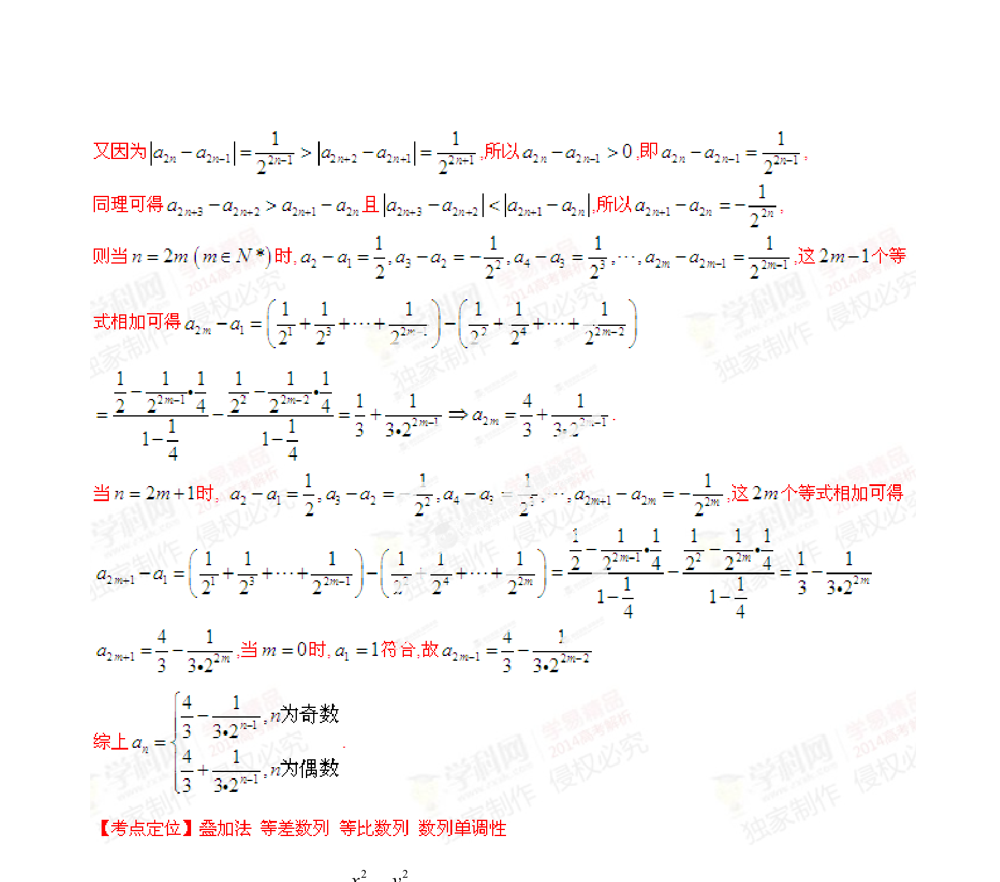

## 题面

## 摘要

已知数列递推关系，结合递增、递减性质及等差数列条件求参数，并求通项公式。

## 关联考点

- [[1382-数列递推|数列递推]]
- [[455-数列单调性|数列单调性]]
- [[356-等差数列概念|等差数列]]
- [[384-数列通项公式|通项公式]]

## 答案与解析

> 📄 原 PDF 第 15 页：`素材/真题/湖南/2008-2024·（湖南）数学高考真题/2014年高考数学试卷（理）（湖南）（解析卷）.pdf`
