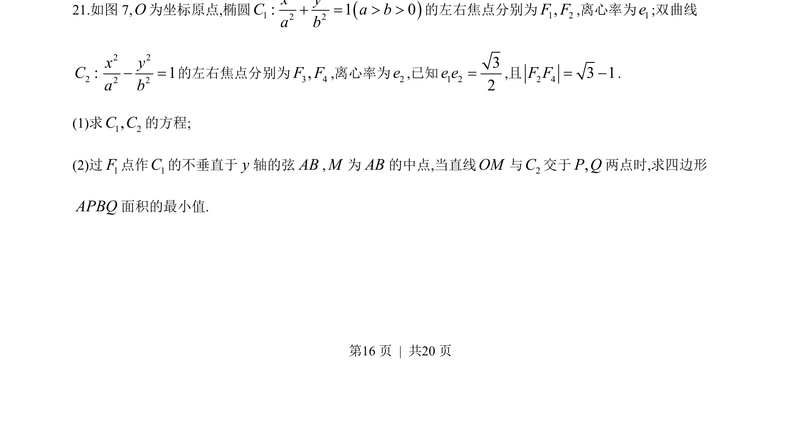
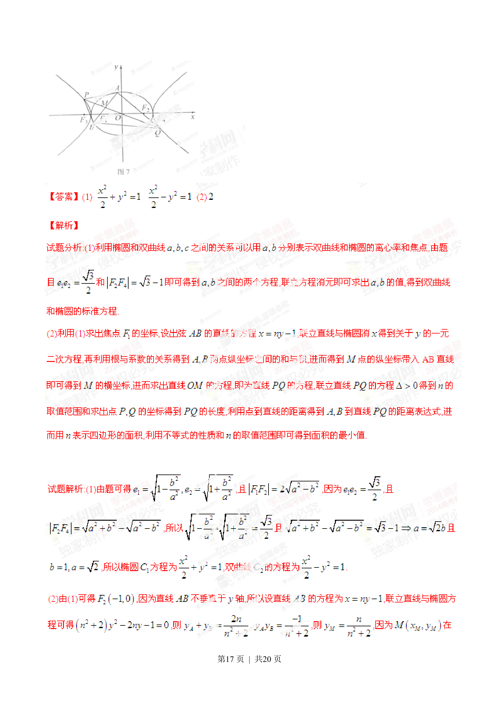
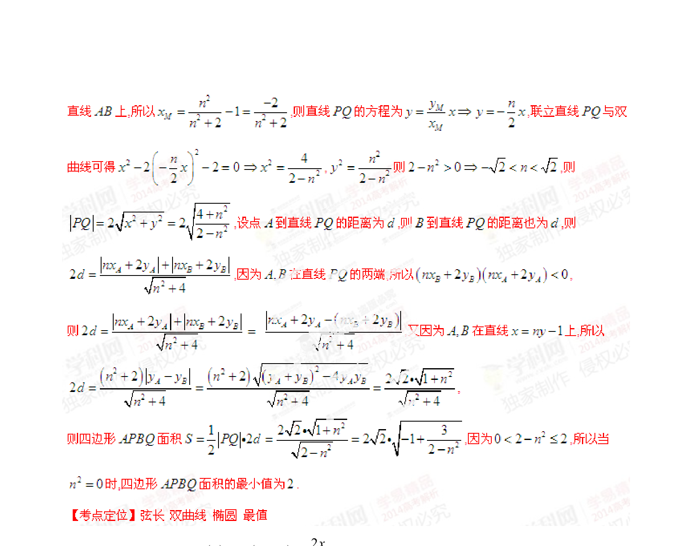

## 题面

## 摘要

椭圆和双曲线方程求解，直线与椭圆相交弦中点轨迹，四边形面积最小值。

## 关联考点

- [[061-方程|椭圆的标准方程]]
- [[732-双曲线的标准方程|双曲线的标准方程]]
- [[391-椭圆离心率|离心率]]
- [[直线与圆锥曲线的综合问题]]
- [[弦的中点]]
- [[面积的最值]]

## 答案与解析

> 📄 原 PDF 第 16 页：`素材/真题/湖南/2008-2024·（湖南）数学高考真题/2014年高考数学试卷（理）（湖南）（解析卷）.pdf`
