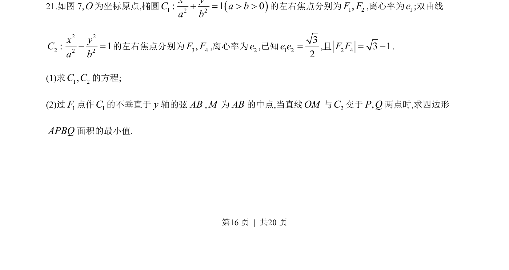
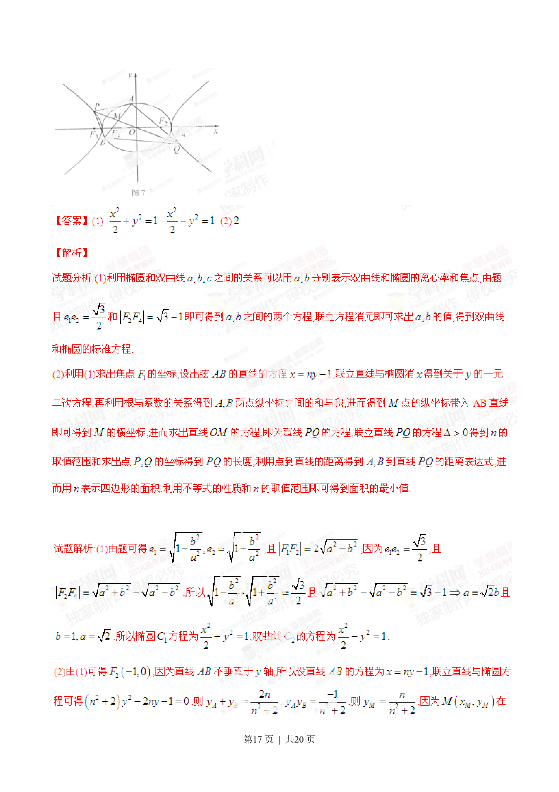
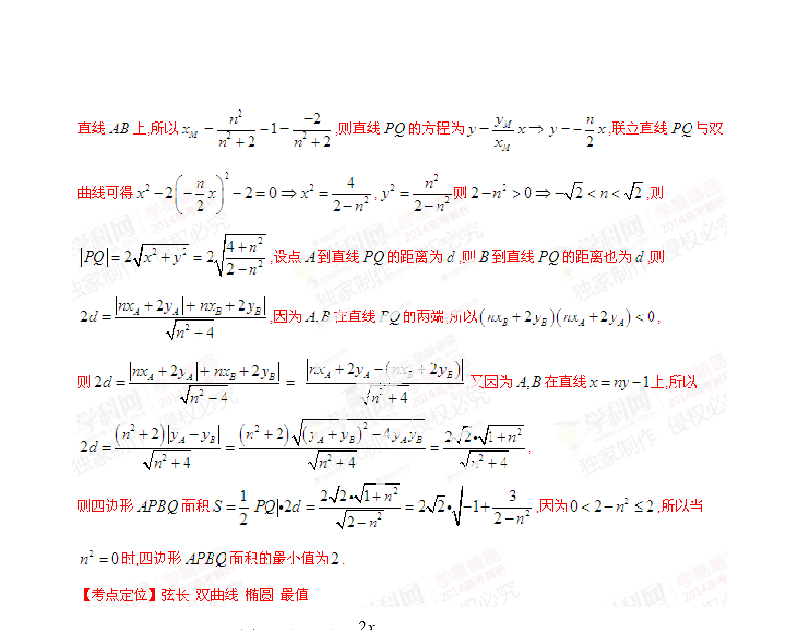

## 题面

## 摘要

椭圆和双曲线方程求解，直线与椭圆相交弦中点轨迹，四边形面积最小值。

## 关联考点

- [[061-方程|椭圆的标准方程]]
- [[732-双曲线的标准方程|双曲线的标准方程]]
- [[391-椭圆离心率|离心率]]
- [[直线与圆锥曲线的综合问题]]
- [[弦的中点]]
- [[面积的最值]]

## 答案与解析

> 📄 原 PDF 第 16 页：`素材/真题/湖南/2008-2024·（湖南）数学高考真题/2014年高考数学试卷（理）（湖南）（解析卷）.pdf`

<!-- 题干文本-start -->
## 题干文本
21.如图7,O为坐标原点,椭圆1:C()2 22 21 0x ya ba b+ = > >的左右焦点分别为1 2,F F,离心率为1e;双曲线
2:C2 22 21x ya b− =的左右焦点分别为3 4,F F,离心率为2e,已知1 232e e=,且2 43 1F F= −.
(1)求1 2,C C的方程;
(2)过1F点作1C的不垂直于y轴的弦AB,M为AB的中点,当直线OM与2C交于,P Q两点时,求四边形
APBQ面积的最小值.
<!-- 题干文本-end -->

<!-- 解析文本-start -->
## 解析文本

<!-- 解析文本-end -->
