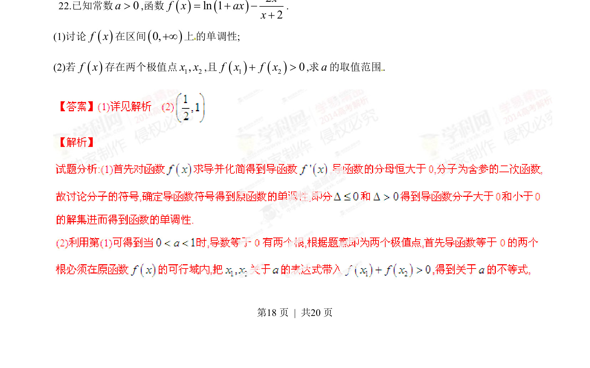
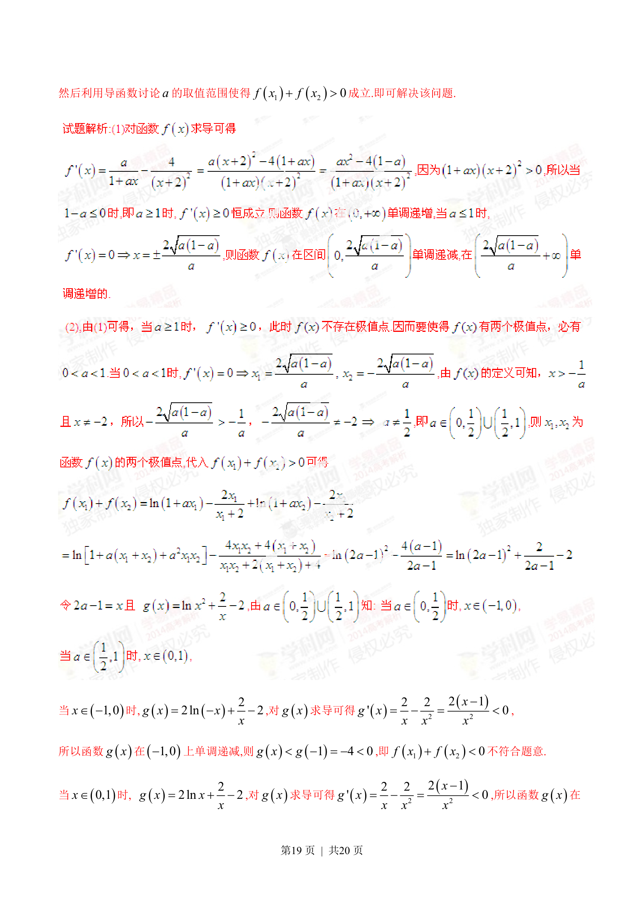
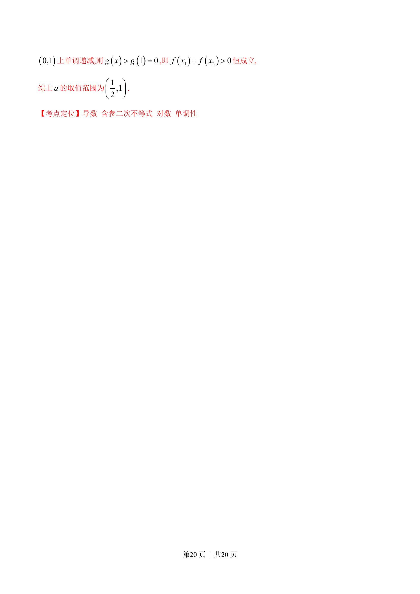

## 题面

## 摘要

研究含参函数的单调性，根据极值点条件求参数范围。

## 关联考点

- [[549-导数运算|导数运算]]
- [[单调性讨论]]
- [[1173-极值点|极值点]]
- [[721-参数取值范围|参数取值范围]]

## 答案与解析

> 📄 原 PDF 第 18 页：`素材/真题/湖南/2008-2024·（湖南）数学高考真题/2014年高考数学试卷（理）（湖南）（解析卷）.pdf`
