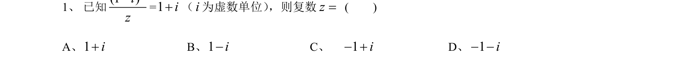
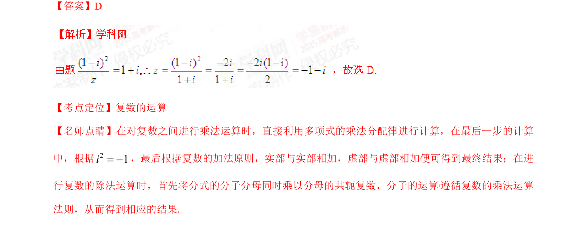

## 题面

## 摘要

复数乘除运算及虚数单位性质应用。

## 关联考点

- [[811-复数运算|复数运算]]
- [[虚数单位性质]]
- [[649-代数运算|代数运算]]

## 答案与解析

> 📄 原 PDF 第 1 页：`素材/真题/湖南/2008-2024·（湖南）数学高考真题/2015年高考数学试卷（文）（湖南）（解析卷）.pdf`

<!-- 题干文本-start -->
## 题干文本
1、已知=（ 为虚数单位） ，则复数 (    )
A、             B、             C、              D、
<!-- 题干文本-end -->

<!-- 解析文本-start -->
## 解析文本
【答案】D
【考点定位】复数的运算
【名师点睛】在对复数之间进行乘法运算时，直接利用多项式的乘法分配律进行计算，在最后一步的计算
中，根据 ，最后根据复数的加法原则，实部与实部相加，虚部与虚部相加便可得到最终结果；在进
行复数的除法运算时，首先将分式的分子分母同时乘以分母的共轭复数，分子的运算遵循复数的乘法运算
法则，从而得到相应的结果.
<!-- 解析文本-end -->
