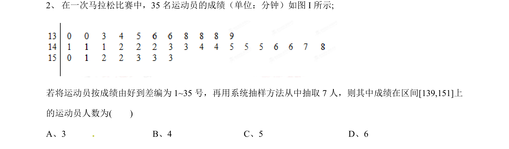
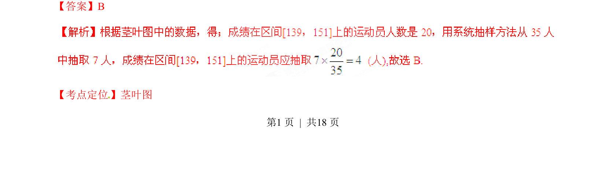
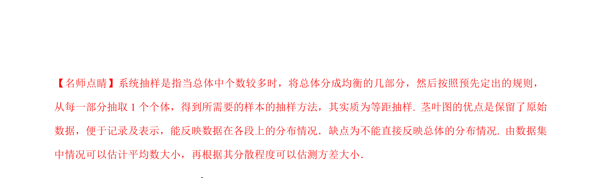

## 题面

## 摘要

本题通过茎叶图呈现数据，结合系统抽样方法求指定区间内的人数。

## 关联考点

- [[360-茎叶图|茎叶图]]
- [[1420-系统抽样|系统抽样]]

## 答案与解析

> 📄 原 PDF 第 1 页：`素材/真题/湖南/2008-2024·（湖南）数学高考真题/2015年高考数学试卷（文）（湖南）（解析卷）.pdf`

<!-- 题干文本-start -->
## 题干文本
2、在一次马拉松比赛中，35名运动员的成绩（单位：分钟）如图I所示;[来源:学#科#网Z#X#X#K]
若将运动员按成绩由好到差编为1~35号，再用系统抽样方法从中抽取7人，则其中成绩在区间[139,151]上
的运动员人数为(    )
A、3                   B、4                C、5                   D、6
<!-- 题干文本-end -->

<!-- 解析文本-start -->
## 解析文本
【答案】B
【考点定位】茎叶图
2(1 )iz-1i+iz=1i+1i-1i- +1i- -
21i= -
<!-- 解析文本-end -->
