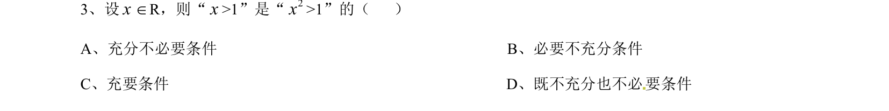
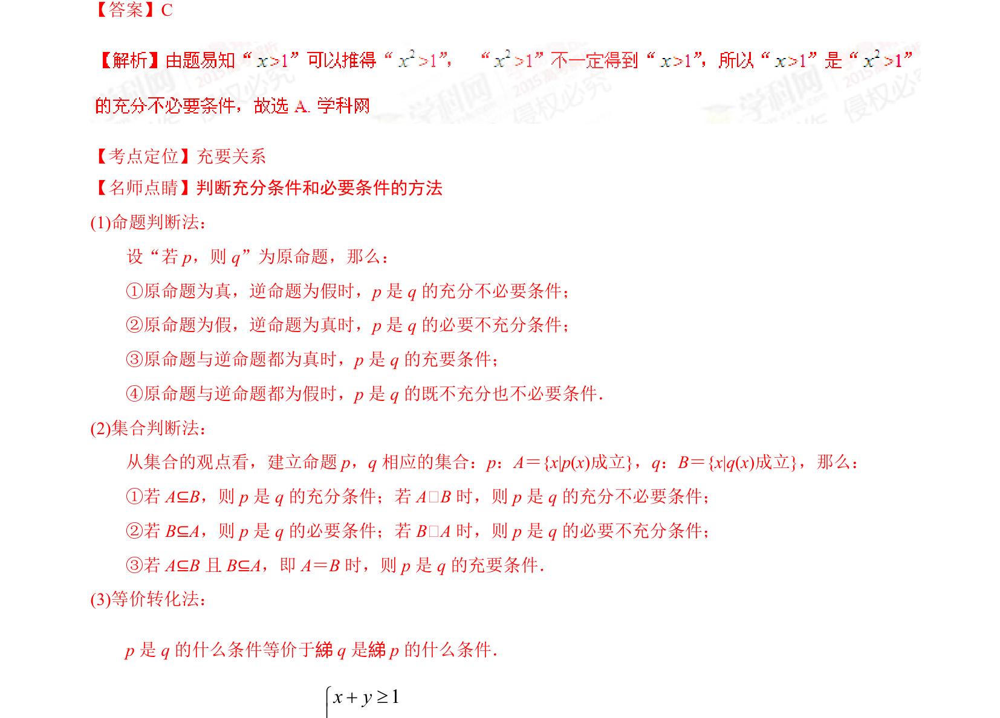

## 题面

## 摘要

考查不等式条件与结论间充分必要关系的判断

## 关联考点

- [[278-充分条件必要条件|充分条件]]
- [[278-充分条件必要条件|必要条件]]
- [[279-充要条件|充要条件]]

## 答案与解析

> 📄 原 PDF 第 2 页：`素材/真题/湖南/2008-2024·（湖南）数学高考真题/2015年高考数学试卷（文）（湖南）（解析卷）.pdf`
