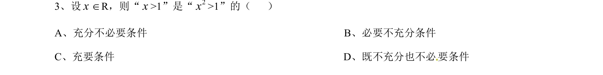
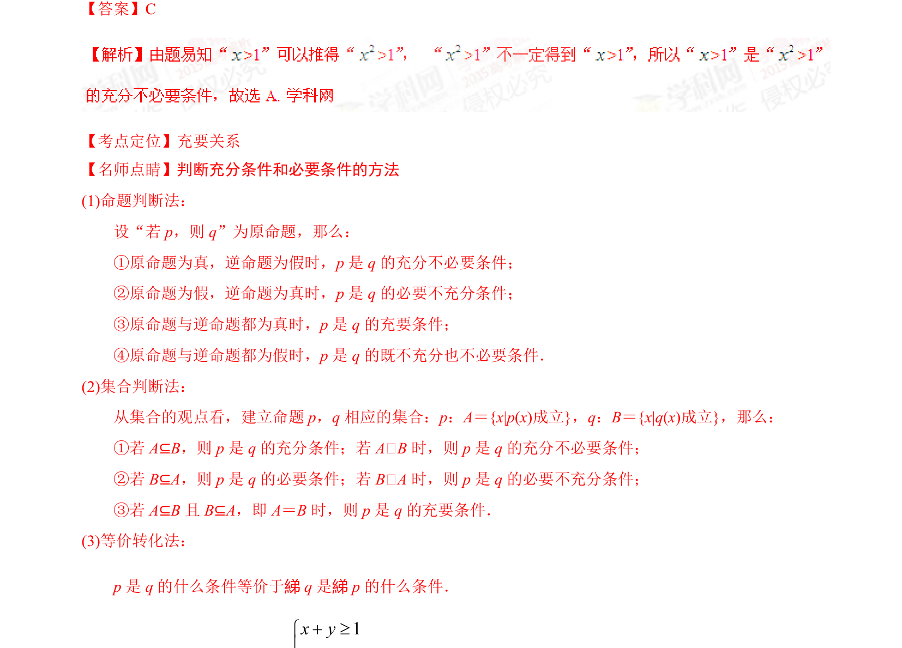

## 题面

## 摘要

考查不等式条件与结论间充分必要关系的判断

## 关联考点

- [[278-充分条件必要条件|充分条件]]
- [[278-充分条件必要条件|必要条件]]
- [[279-充要条件|充要条件]]

## 答案与解析

> 📄 原 PDF 第 2 页：`素材/真题/湖南/2008-2024·（湖南）数学高考真题/2015年高考数学试卷（文）（湖南）（解析卷）.pdf`

<!-- 题干文本-start -->
## 题干文本
3、设R，则“>1”是“>1”的（   ） 
A、充分不必要条件                                     B、必要不充分条件
C、充要条件                                           D、既不充分也不必要条件
<!-- 题干文本-end -->

<!-- 解析文本-start -->
## 解析文本
【答案】C
【考点定位】充要关系
【名师点睛】判断充分条件和必要条件的方法
(1)命题判断法：
设“若p，则q”为原命题，那么：[来源:学,科,网Z,X,X,K]
①原命题为真，逆命题为假时，p是q的充分不必要条件；
②原命题为假，逆命题为真时，p是q的必要不充分条件；
③原命题与逆命题都为真时，p是q的充要条件；
④原命题与逆命题都为假时，p是q的既不充分也不必要条件．
(2)集合判断法：
从集合的观点看，建立命题p，q相应的集合：p：A＝{x|p(x)成立}，q：B＝{x|q(x)成立}，那么：
①若A⊆B，则p是q的充分条件；若A￿B时，则p是q的充分不必要条件；
②若B⊆A，则p是q的必要条件；若B￿A时，则p是q的必要不充分条件；
③若A⊆B且B⊆A，即A＝B时，则p是q的充要条件．
(3)等价转化法：
p是q的什么条件等价于綈q是綈p的什么条件．
<!-- 解析文本-end -->
