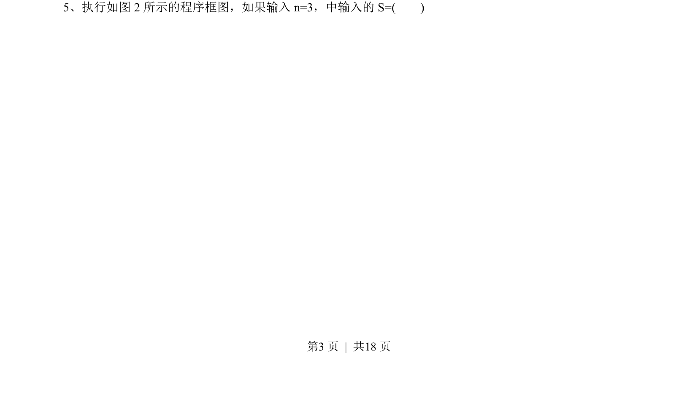
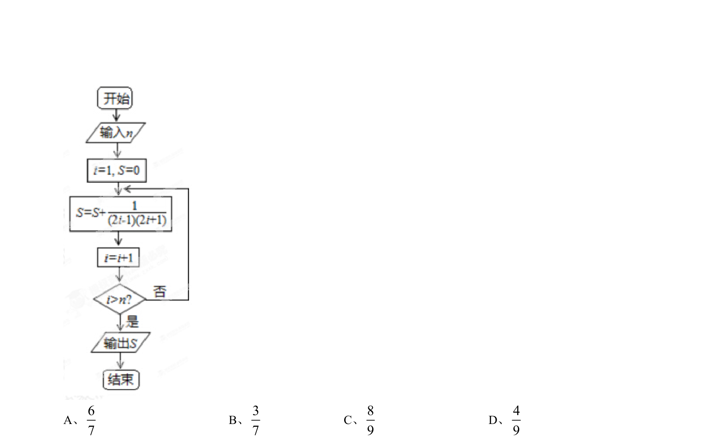
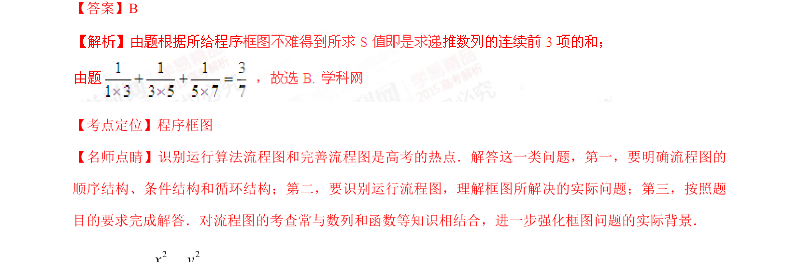

## 题面

## 摘要

输入n=3，执行程序框图求输出S的值，考查循环结构与算法逻辑。

## 关联考点

- [[1042-程序框图|程序框图]]
- [[870-循环结构|循环结构]]
- [[916-条件判断|条件判断]]

## 答案与解析

> 📄 原 PDF 第 3 页：`素材/真题/湖南/2008-2024·（湖南）数学高考真题/2015年高考数学试卷（文）（湖南）（解析卷）.pdf`
