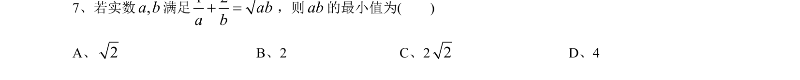
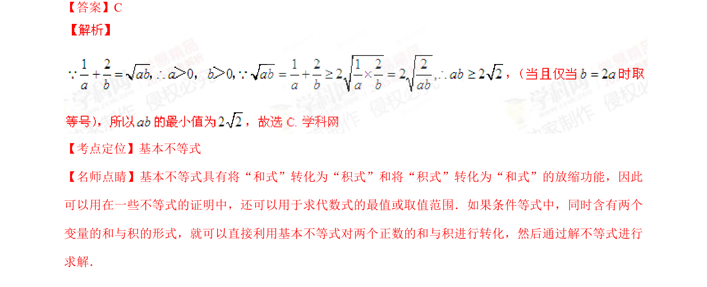

## 题面

## 摘要

利用基本不等式将两个变量的和与积进行转化，求最小值。

## 关联考点

- [[295-基本不等式|基本不等式]]
- [[913-最值问题|最值问题]]

## 答案与解析

> 📄 原 PDF 第 5 页：`素材/真题/湖南/2008-2024·（湖南）数学高考真题/2015年高考数学试卷（文）（湖南）（解析卷）.pdf`

<!-- 题干文本-start -->
## 题干文本
7、若实数 满足 ，则 的最小值为(    )
A、                   B、2                C、2                 D、4
<!-- 题干文本-end -->

<!-- 解析文本-start -->
## 解析文本
【答案】C
【考点定位】基本不等式
【名师点睛】基本不等式具有将“和式”转化为“积式”和将“积式”转化为“和式”的放缩功能，因此
可以用在一些不等式的证明中，还可以用于求代数式的最值或取值范围．如果条件等式中，同时含有两个
变量的和与积的形式，就可以直接利用基本不等式对两个正数的和与积进行转化，然后通过解不等式进行
求解．
<!-- 解析文本-end -->
