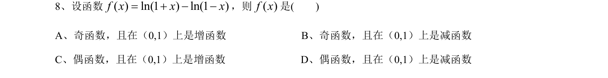
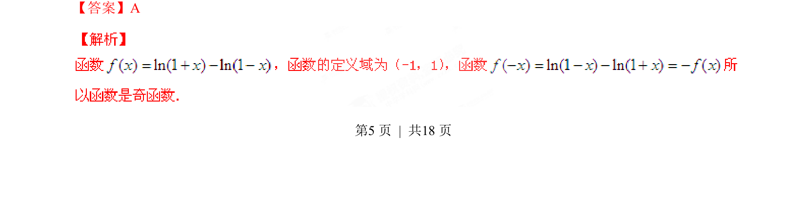
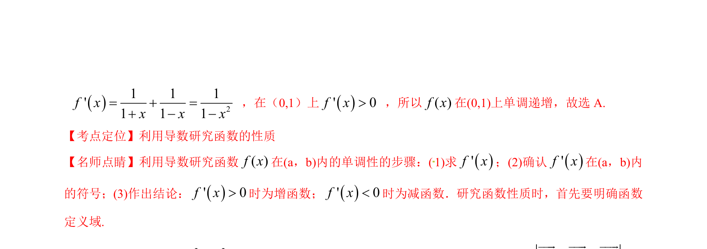

## 题面

## 摘要

考查函数奇偶性与单调性的判断，涉及对数型复合函数的性质分析。

## 关联考点

- [[679-函数奇偶性|函数奇偶性]]
- [[432-导数与函数单调性|函数单调性]]
- [[298-对数函数|对数函数性质]]
- [[296-复合函数|复合函数]]

## 答案与解析

> 📄 原 PDF 第 5 页：`素材/真题/湖南/2008-2024·（湖南）数学高考真题/2015年高考数学试卷（文）（湖南）（解析卷）.pdf`
