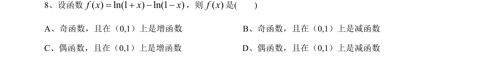
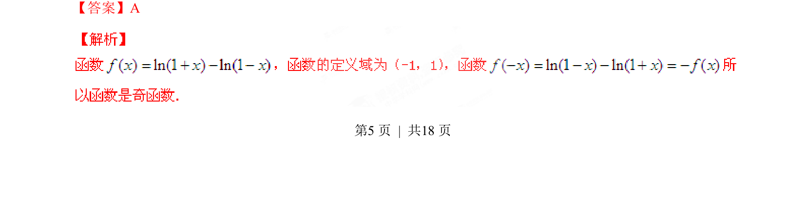
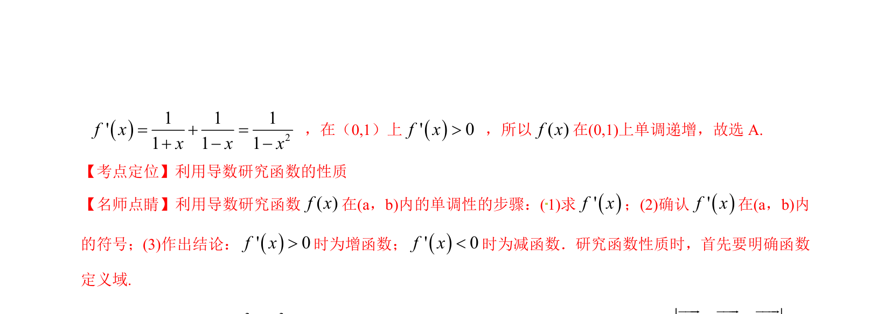

## 题面

## 摘要

考查函数奇偶性与单调性的判断，涉及对数型复合函数的性质分析。

## 关联考点

- [[284-函数的奇偶性|函数奇偶性]]
- [[432-导数与函数单调性|函数单调性]]
- [[298-对数函数|对数函数性质]]
- [[296-复合函数|复合函数]]

## 答案与解析

> 📄 原 PDF 第 5 页：`素材/真题/湖南/2008-2024·（湖南）数学高考真题/2015年高考数学试卷（文）（湖南）（解析卷）.pdf`

<!-- 题干文本-start -->
## 题干文本
8、设函数 ，则 是(    )
A、奇函数，且在（0,1）上是增函数              B、奇函数，且在（0,1）上是减函数
C、偶函数，且在（0,1）上是增函数              D、偶函数，且在（0,1）上是减函数
<!-- 题干文本-end -->

<!-- 解析文本-start -->
## 解析文本
【答案】A
2 22 21x ya b- =2 22 2( 0)x ya bl l- = ¹by xa= ±2 22 2( 0)x ya bl l- = ¹b2 22 21( 0. 0)x ya ba b- = > >
2 2221b c aea a-= = -,a b1 2aba b+ =ab2 2
( ) ln(1 ) ln(1 )f x x x= + - -( )f x
<!-- 解析文本-end -->
