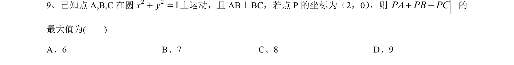
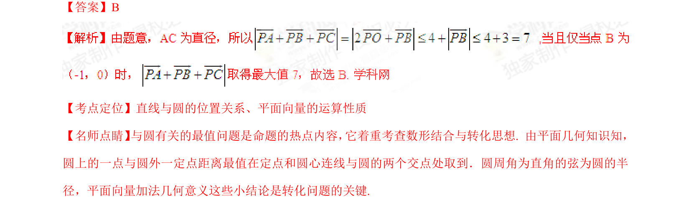

## 题面

## 摘要

本题通过圆上动点与定点，结合垂直关系和向量运算求模的最大值，考查数形结合与转化思想。

## 关联考点

- [[394-直线和圆位置关系-高中|直线与圆的位置关系]]
- [[平面向量的运算性质]]

## 答案与解析

> 📄 原 PDF 第 6 页：`素材/真题/湖南/2008-2024·（湖南）数学高考真题/2015年高考数学试卷（文）（湖南）（解析卷）.pdf`
