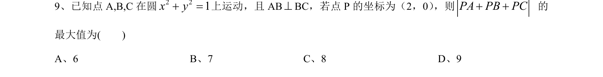
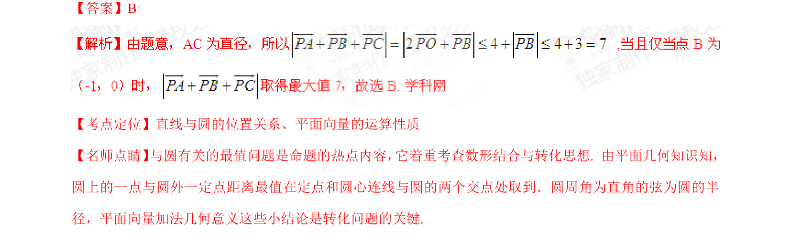

## 题面

## 摘要

本题通过圆上动点与定点，结合垂直关系和向量运算求模的最大值，考查数形结合与转化思想。

## 关联考点

- [[394-直线和圆位置关系-高中|直线与圆的位置关系]]
- [[平面向量的运算性质]]

## 答案与解析

> 📄 原 PDF 第 6 页：`素材/真题/湖南/2008-2024·（湖南）数学高考真题/2015年高考数学试卷（文）（湖南）（解析卷）.pdf`

<!-- 题干文本-start -->
## 题干文本
9、已知点A,B,C在圆 上运动，且AB BC，若点P的坐标为（2，0） ，则 的
最大值为(    )
A、6                     B、7                 C、8                     D、9
<!-- 题干文本-end -->

<!-- 解析文本-start -->
## 解析文本
【答案】B
【考点定位】直线与圆的位置关系、平面向量的运算性质
【名师点睛】 与圆有关的最值问题是命题的热点内容， 它着重考查数形结合与转化思想. 由平面几何知识知，
圆上的一点与圆外一定点距离最值在定点和圆心连线与圆的两个交点处取到．圆周角为直角的弦为圆的半
径，平面向量加法几何意义这些小结论是转化问题的关键.
<!-- 解析文本-end -->
