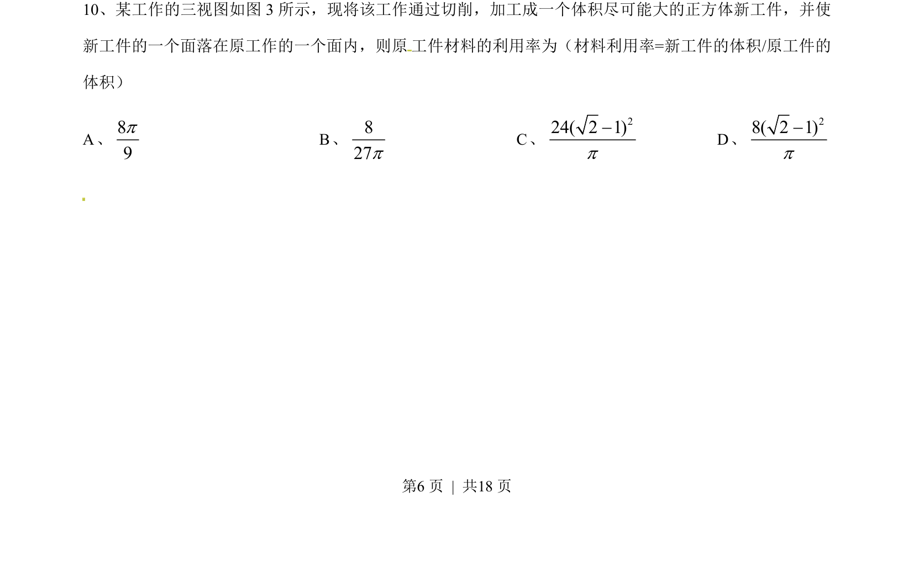
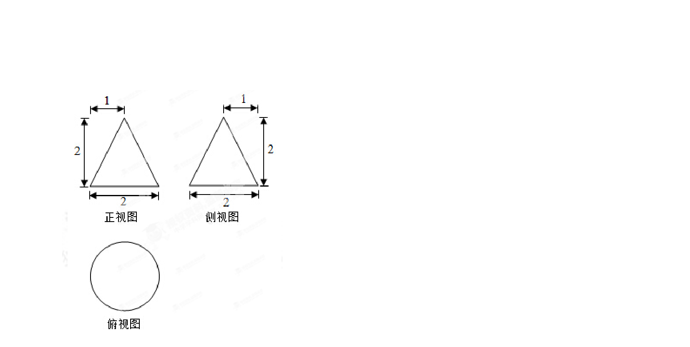
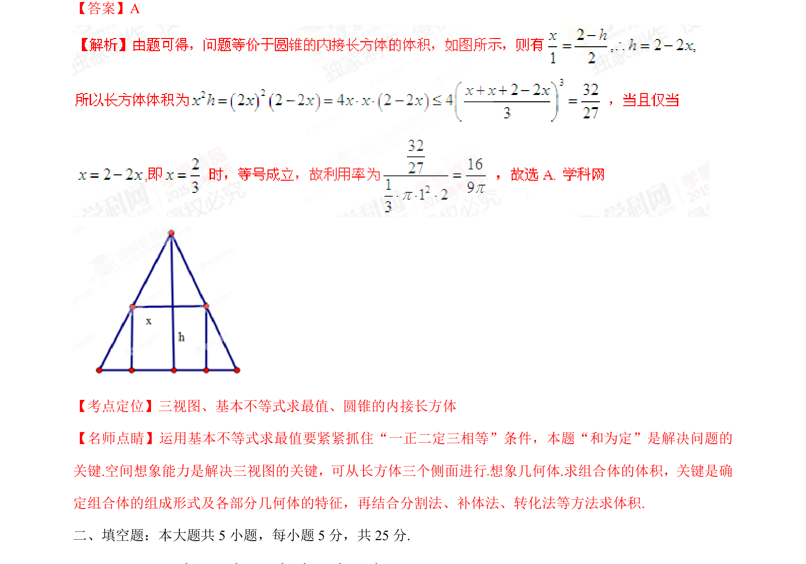

## 题面

## 摘要

考查由三视图还原几何体，通过切削加工为最大正方体，计算体积并求材料利用率。

## 关联考点

- [[235-三视图|三视图]]
- [[1193-几何体体积计算|空间几何体体积]]
- [[019-正方体|正方体]]
- [[913-最值问题|最值问题]]

## 答案与解析

> 📄 原 PDF 第 6 页：`素材/真题/湖南/2008-2024·（湖南）数学高考真题/2015年高考数学试卷（文）（湖南）（解析卷）.pdf`
