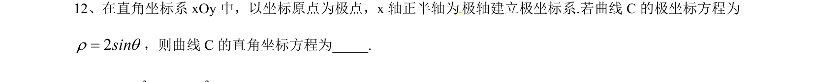
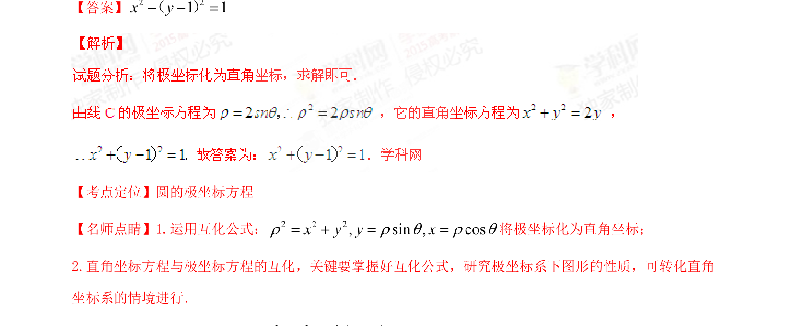

## 题面

## 摘要

将极坐标方程转化为直角坐标方程，考查极坐标与直角坐标的互化公式应用。

## 关联考点

- [[921-极坐标方程|极坐标方程]]
- [[1032-直角坐标方程|直角坐标方程]]
- [[互化公式]]
- [[782-圆的方程|圆的方程]]

## 答案与解析

> 📄 原 PDF 第 8 页：`素材/真题/湖南/2008-2024·（湖南）数学高考真题/2015年高考数学试卷（文）（湖南）（解析卷）.pdf`
