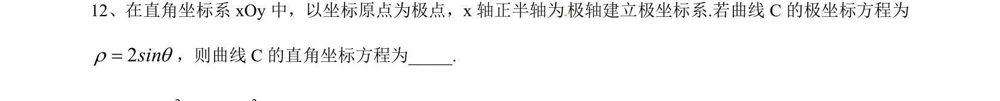
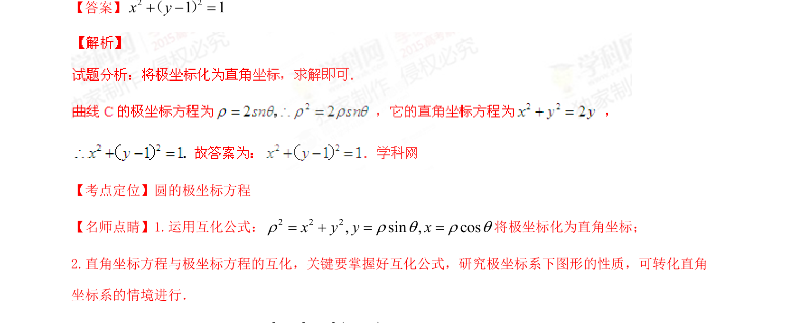

## 题面

## 摘要

将极坐标方程转化为直角坐标方程，考查极坐标与直角坐标的互化公式应用。

## 关联考点

- [[921-极坐标方程|极坐标方程]]
- [[1032-直角坐标方程|直角坐标方程]]
- [[互化公式]]
- [[782-圆的方程|圆的方程]]

## 答案与解析

> 📄 原 PDF 第 8 页：`素材/真题/湖南/2008-2024·（湖南）数学高考真题/2015年高考数学试卷（文）（湖南）（解析卷）.pdf`

<!-- 题干文本-start -->
## 题干文本
12、在直角坐标系xOy中，以坐标原点为极点，x轴正半轴为极轴建立极坐标系.若曲线C的极坐标方程为
，则曲线C的直角坐标方程为_____.
<!-- 题干文本-end -->

<!-- 解析文本-start -->
## 解析文本
【答案】
【考点定位】圆的极坐标方程
【名师点睛】1.运用互化公式： 将极坐标化为直角坐标；
2.直角坐标方程与极坐标方程的互化，关键要掌握好互化公式，研究极坐标系下图形的性质，可转化直角
坐标系的情境进行．
<!-- 解析文本-end -->
