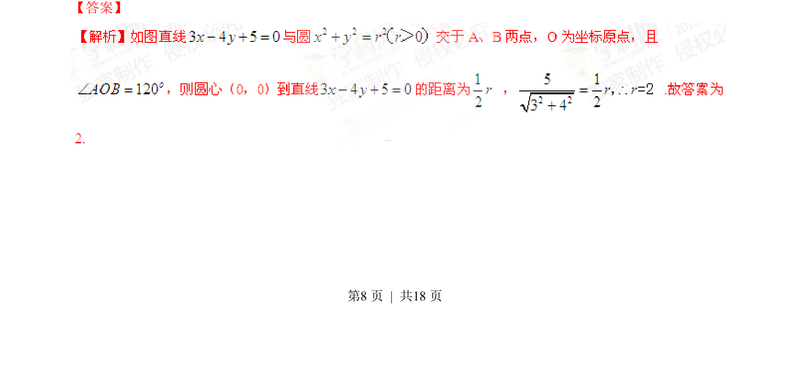
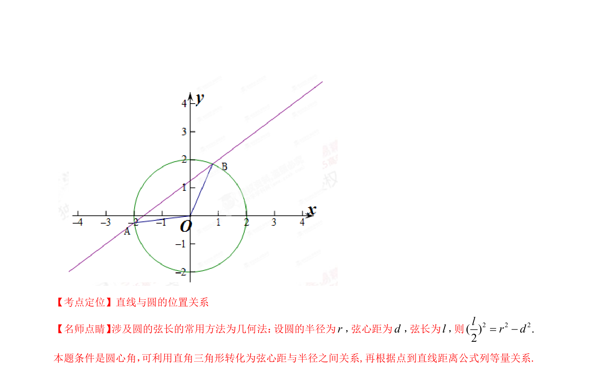

## 题面

## 摘要

直线与圆相交，已知圆心角求半径，考查圆的弦长与点到直线距离关系。

## 关联考点

- [[394-直线和圆位置关系-高中|直线与圆的位置关系]]
- [[392-点到直线距离公式|点到直线距离公式]]
- [[224-垂径定理|垂径定理]]
- [[圆心角与弦长]]

## 答案与解析

> 📄 原 PDF 第 8 页：`素材/真题/湖南/2008-2024·（湖南）数学高考真题/2015年高考数学试卷（文）（湖南）（解析卷）.pdf`
