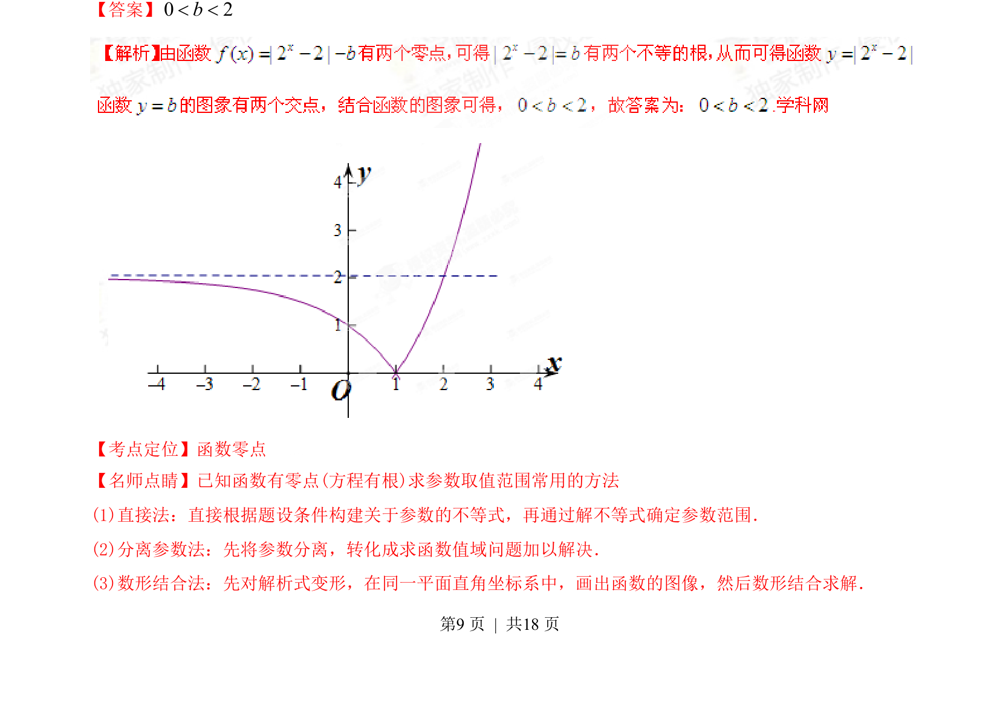

## 题面

## 摘要

已知函数有两个零点求参数取值范围，考查函数零点与方程根的转化及数形结合思想。

## 关联考点

- [[288-函数零点|函数零点]]
- [[721-参数取值范围|参数取值范围]]
- [[897-数形结合|数形结合]]

## 答案与解析

> 📄 原 PDF 第 9 页：`素材/真题/湖南/2008-2024·（湖南）数学高考真题/2015年高考数学试卷（文）（湖南）（解析卷）.pdf`
