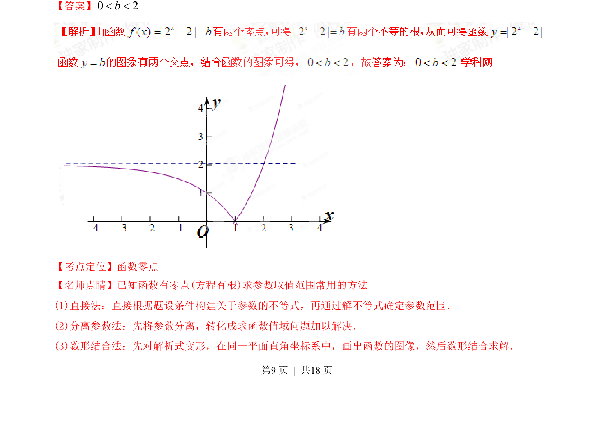

## 题面

## 摘要

已知函数有两个零点求参数取值范围，考查函数零点与方程根的转化及数形结合思想。

## 关联考点

- [[288-函数零点|函数零点]]
- [[721-参数取值范围|参数取值范围]]
- [[897-数形结合|数形结合]]

## 答案与解析

> 📄 原 PDF 第 9 页：`素材/真题/湖南/2008-2024·（湖南）数学高考真题/2015年高考数学试卷（文）（湖南）（解析卷）.pdf`

<!-- 题干文本-start -->
## 题干文本
14、若函数 有两个零点，则实数 的取值范围是_____.
<!-- 题干文本-end -->

<!-- 解析文本-start -->
## 解析文本
【答案】
 
【考点定位】函数零点[来源:学_科_网Z_X_X_K]
【名师点睛】已知函数有零点(方程有根)求参数取值范围常用的方法
(1)直接法：直接根据题设条件构建关于参数的不等式，再通过解不等式确定参数范围．
(2)分离参数法：先将参数分离，转化成求函数值域问题加以解决．
(3)数形结合法：先对解析式变形，在同一平面直角坐标系中，画出函数的图像，然后数形结合求解．
rdl2 2 2( ) .2lr d= -( ) | 2 2 |xf x b= - -b0 2b< <
<!-- 解析文本-end -->
